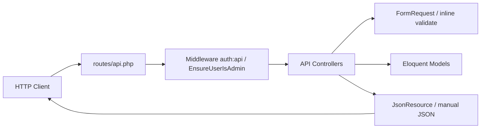
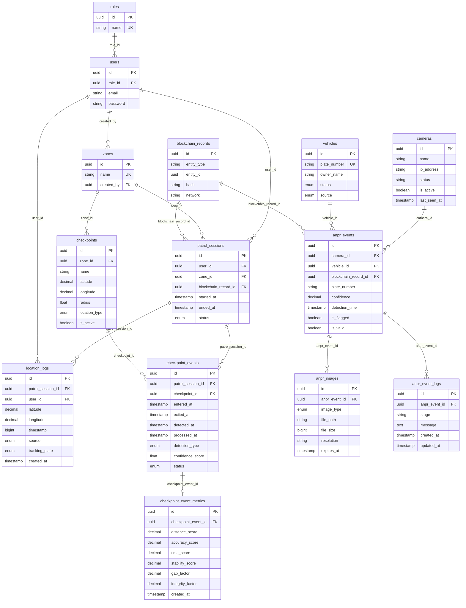

# Backend Laravel API — Technical Documentation

This document describes the `**backend-laravel-v1**` Laravel application as implemented in the repository. It is intended for developers and maintainers. Where something cannot be inferred from the codebase, it is stated explicitly.

---

## Table of contents

1. [Project overview](#1-project-overview)
2. [System architecture](#2-system-architecture)
3. [Directory structure](#3-directory-structure)
4. [API documentation](#4-api-documentation)
5. [Database documentation](#5-database-documentation)
6. [Authentication & authorization](#6-authentication--authorization)
7. [Services & business logic](#7-services--business-logic)
8. [Configuration](#8-configuration)
9. [External integrations](#9-external-integrations)
10. [Dependencies](#10-dependencies)
11. [Deployment & environment setup](#11-deployment--environment-setup)
12. [Automated test coverage](#12-automated-test-coverage)
13. [Known issues / technical debt](#13-known-issues--technical-debt)

---

## 1. Project overview

### Purpose

The application is a **JSON API backend** (Laravel) that supports:

- **User and role management** (including soft deletes and restore).
- **JWT-based authentication** for protected routes.
- **Geographic / facility “zones”** with admin-only mutations; authenticated users can list/view zones.
- **Checkpoint events** on patrol sessions (backend-derived validation results per checkpoint), exposed as JWT-protected CRUD under `/api/checkpoint-events`.
- **Checkpoint event metrics** (one scoring breakdown per checkpoint event), exposed as JWT-protected CRUD under `/api/checkpoint-event-metrics`.
- **Patrol location logs** (immutable, append-only GPS evidence tied to a patrol session and user), ingested and queried under `/api/location-logs` with JWT; **no** HTTP update or delete; **no** link to checkpoints.
- **Patrol route breadcrumbs** (append-only track points per patrol session), `**GET` / `POST /api/patrol-routes`** with JWT.
- **Realtime patrol monitoring** via **Laravel Reverb** (WebSockets): private channels `patrol.monitoring` and `patrol.session.{id}`; JWT auth at `**POST /api/broadcasting/auth`**; events fired from patrol session / route / checkpoint / validation flows (**REST unchanged**).
- **Blockchain record metadata** storage and querying (status, network, environment, entity linkage), aligned with concepts like Ganache/Sepolia and development/production environments.
- **Camera records** for ANPR capture sources and status tracking, exposed as JWT-protected CRUD under `/api/cameras`.
- **Vehicle records** for watchlist/allowlist workflows with CRUD under `/api/vehicles`.
- **ANPR events** for plate detections tied to cameras with optional vehicle/blockchain linkage, exposed as JWT-protected CRUD under `/api/anpr-events` with **M10** list filters, safe nested camera serialization, and `AnprEventResource` responses.
- **ANPR images** metadata for event-linked image assets (full/plate/annotated), exposed as JWT-protected CRUD under `/api/anpr-images`, plus a protected file proxy at `GET /api/anpr-images/{id}/file` when paths resolve under configured `ANPR_IMAGE_ROOTS`.
- **ANPR event logs** for event-linked processing/audit messages (`stage`, optional `message`), exposed as JWT-protected CRUD under `/api/anpr-event-logs` (audit/API only — not rendered in the M10 React monitoring UI).

There is no separate SPA or mobile app in this repository; the default `package.json` only wires **Vite + Tailwind** for Laravel’s frontend build (e.g. `welcome` view), not a full product UI.

### Core business functionality (from code)


| Area                     | Behavior                                                                                                                                                                                                                                                                                                                                                                                                                                                                                                                                        |
| ------------------------ | ----------------------------------------------------------------------------------------------------------------------------------------------------------------------------------------------------------------------------------------------------------------------------------------------------------------------------------------------------------------------------------------------------------------------------------------------------------------------------------------------------------------------------------------------- |
| Users                    | CRUD via API resources; optional `only_trashed` / `include_trashed` on index; soft delete; restore endpoint.                                                                                                                                                                                                                                                                                                                                                                                                                                    |
| Roles                    | Read-only listing and show (no create/update/delete routes).                                                                                                                                                                                                                                                                                                                                                                                                                                                                                    |
| Auth                     | Email/password login returns JWT (`access_token`, `token_type`, `expires_in`) plus authenticated `user` and `role`; authenticated clients can call `auth/me` and `auth/logout`.                                                                                                                                                                                                                                                                                                                                                                 |
| Zones                    | Full REST under `auth:api`; create/update/delete require role name exactly `**Admin`**; responses include `checkpoints_count` derived from related checkpoints.                                                                                                                                                                                                                                                                                                                                                                                  |
| Checkpoints              | Full REST under `auth:api`; supports pagination, filtering (`zone_id`, `is_active`, `location_type`), and name search.                                                                                                                                                                                                                                                                                                                                                                                                                          |
| Patrol sessions          | Full REST under `auth:api`; supports pagination, filtering (`user_id`, `zone_id`, `status`), and sorting by `started_at`. `**GET /api/patrol-sessions/{id}/summary**` returns a gap-aware computed summary (not persisted). `**POST /api/patrol-sessions/{id}/validate**` runs the backend validation engine (Milestone 1): reconstructs movement from `location_logs`, scores checkpoints, persists `checkpoint_events` + `checkpoint_event_metrics`.                                                                                          |
| Patrol routes            | `**GET` / `POST /api/patrol-routes**` under `auth:api` — append-only GPS breadcrumb rows (`patrol_routes`); FK `**patrol_session_id**`; `**GET**` supports filter `patrol_session_id`, sort `recorded_at` asc, pagination (`per_page` max **1000**, default **500**); **no** update/delete. `**POST`** optional `**patrol_log_id**` body alias merged to canonical session id before validation.                                                                                                                                                |
| Checkpoint events        | Full REST under `auth:api`; backend stores **validation context** per checkpoint visit (`entered_at`, `exited_at`, `detected_at`, `processed_at`, `detection_type`, `confidence_score`, `status`); pagination; filtering (`patrol_session_id`, `checkpoint_id`, `status`, `detection_type`); sorting by `detected_at` (`latest` / `oldest`). Authoritative scores come from `**POST …/validate`** (`PatrolValidationService`); PWA PATCH may still send provisional metadata during patrol. No foreign key to `location_logs`. No soft deletes. |
| Checkpoint event metrics | Full REST under `auth:api`; one row per checkpoint event (unique `checkpoint_event_id`); scoring factors for explaining confidence; `calculated_confidence_score` returned via API resource only (not stored). No soft deletes.                                                                                                                                                                                                                                                                                                                 |
| Location logs            | `index` / `store` / `show` under `auth:api` (**no** `update` or `destroy`; immutable append-only raw evidence). Pagination; filters `patrol_session_id`, `user_id`; default sort by device `timestamp` ascending; `server_received_at` set on create for sync-delay analysis. Device `timestamp` is **unsigned bigint milliseconds** (not a SQL `timestamp` column). Ingest via `POST /location-logs` or `POST /pwa/sync` passes through `LocationLogTimestampService` so values are **strictly increasing per patrol session** (mobile GPS often repeats second-precision fixes). Not linked to checkpoints. Deletion is intentionally unsupported (Milestone 13). |
| PWA location sync        | `**POST /api/pwa/sync`** under `auth:api` — accepts queued `**location_log**` payloads (camelCase fields from the PWA client); stores rows in `**location_logs**` with client `**locationLogId**` as primary key for idempotent replay. Duplicate device timestamps for the same patrol are bumped server-side before insert.                                                                                                                                                                                                                                                                                         |
| Cameras                  | Full REST under `auth:api`; CRUD camera records for ANPR/RTSP management with indexing on `is_active`, `ip_address`, and `last_seen_at`.                                                                                                                                                                                                                                                                                                                                                                                                        |
| Vehicles                 | Full REST under `auth:api`; UUID records keyed by `plate_number` uniqueness with status/source enums for monitoring workflows.                                                                                                                                                                                                                                                                                                                                                                                                                  |
| ANPR events              | Full REST under `auth:api`; stores plate detections with required `camera_id`, optional `vehicle_id` and optional `blockchain_record_id`; indexed by plate/time/flags and FK columns. **M10:** `index` supports `per_page`, `page`, `plate_number`, `search`, `is_valid`, `is_flagged`, `date_from`, `date_to`, `camera_id`; responses use `AnprEventResource` with safe nested `camera` / `vehicle` / `images` (no `logs` eager-load on monitoring responses). |
| ANPR images              | Full REST under `auth:api`; stores ANPR image metadata with required `anpr_event_id`, `image_type` (`full`, `plate`, `annotated`), and `file_path`; optional file size/resolution/expiry; indexed by event/type/expiry. **M10:** `AnprImageResource` adds `url` / `image_url` when the file resolves under `ANPR_IMAGE_ROOTS`; `GET /api/anpr-images/{anpr_image}/file` serves the binary via `AnprImageFileService` (path traversal rejected). |
| ANPR event logs          | Full REST under `auth:api`; stores ANPR event processing logs with required `anpr_event_id`, required `stage` (max 50), and optional `message`; indexed by event and stage. Used for AI-runtime audit; not consumed by the M10 frontend monitoring UI.                                                                                                                                                                                                                                                                                                                                                                     |
| Blockchain records       | Read-only index (filters, sort, pagination) and show.                                                                                                                                                                                                                                                                                                                                                                                                                                                                                           |


### Main modules / features

- **API layer**: `routes/api.php`, controllers under `App\Http\Controllers\Api`.
- **Domain models**: `User`, `Role`, `Zone`, `Checkpoint`, `PatrolSession`, `PatrolRoute`, `CheckpointEvent`, `CheckpointEventMetric`, `LocationLog`, `Camera`, `Vehicle`, `AnprEvent`, `AnprImage`, `AnprEventLog`, and `BlockchainRecord`.
- **Validation**: Form requests for users/zones/checkpoints/patrol-sessions/checkpoint-events/checkpoint-event-metrics/location-logs/patrol-routes/cameras (`StoreLocationLogRequest` only for location logs; `StorePatrolRouteRequest` for patrol breadcrumbs; `StoreCameraRequest` + `UpdateCameraRequest` for cameras); inline validation for auth login and some index query params.

### Runtime versions (from `composer.json`)


| Item                  | Value   |
| --------------------- | ------- |
| **PHP**               | `^8.3`  |
| **Laravel framework** | `^13.0` |


### Frontend / backend technologies


| Layer                       | Technology                                                  |
| --------------------------- | ----------------------------------------------------------- |
| Backend                     | Laravel 13, PHP 8.3+                                        |
| API auth                    | JWT via `php-open-source-saver/jwt-auth` (`auth:api` guard) |
| Default DB (`.env.example`) | SQLite (`DB_CONNECTION=mysql`)                              |
| Asset pipeline              | Vite 8, Tailwind 4, `laravel-vite-plugin` (dev/build only)  |


### Important Composer / NPM packages

**Composer (production):**


| Package                          | Role                         |
| -------------------------------- | ---------------------------- |
| `laravel/framework`              | Core framework               |
| `php-open-source-saver/jwt-auth` | JWT guard and token issuance |
| `laravel/tinker`                 | REPL (dev/ops)               |


**Composer (development):** Faker, Pint, Pail, Pao, Collision, PHPUnit — standard Laravel testing and tooling.

**NPM:** `vite`, `laravel-vite-plugin`, `tailwindcss`, `@tailwindcss/vite`, `concurrently` — asset building; used by Composer `dev` script alongside `php artisan serve` and queue listener.

---

## 2. System architecture

### Overall architecture

The app follows **Laravel’s MVC-oriented HTTP stack**:

- **Routes** map HTTP verbs to **controllers**.
- **Eloquent models** encapsulate persistence and relationships.
- **Form requests** validate input for users, zones, checkpoints, patrol sessions, patrol route creation (`**StorePatrolRouteRequest`**), checkpoint events, checkpoint event metrics, location log creation, PWA `**location_log**` sync (`**SyncPwaLocationLogRequest**`), and cameras.
- **API resources** shape JSON for users, roles, zones, checkpoints, patrol sessions, patrol breadcrumbs (`**PatrolRouteResource`**), checkpoint events, checkpoint event metrics, location logs, blockchain records, and **ANPR** modules (`**AnprEventResource**`, `**AnprImageResource**`, `**AnprCameraResource**`, `**AnprVehicleResource**`).
- **Custom middleware** (`EnsureUserIsAdmin`) enforces an admin role for specific zone mutations.
- **Global exception rendering** in `bootstrap/app.php` normalizes JSON errors for API/JSON clients (validation, auth, JWT, 404).

There is a small `**App\Services`** layer for patrol aggregation/validation; **no** repository pattern and **no** domain events/jobs in `app/`.

### MVC and API flow




### Request lifecycle (simplified)

1. Request hits `public/index.php` → Laravel bootstrap (`bootstrap/app.php`).
2. Router matches `routes/api.php` (prefix `**/api**` by framework convention).
3. Middleware runs: e.g. `auth:api` on the `zones` / `checkpoints` / `patrol-sessions` / `checkpoint-events` / `checkpoint-event-metrics` / `location-logs` / `vehicles` group; `ZoneController` adds `auth:api` again in constructor and `EnsureUserIsAdmin` for `store` / `update` / `destroy`.
4. Controller action runs (validation, queries, responses).
5. Exceptions may be converted to JSON in `bootstrap/app.php` (`ValidationException`, `AuthenticationException`, `JWTException`, `ModelNotFoundException`, `NotFoundHttpException`).

### Modular structure

Unable to determine from current implementation — the codebase is a **single Laravel app** with no package/modules split beyond standard `app/` namespaces.

---

## 3. Directory structure

Important paths under `backend-laravel-v1` and their responsibilities:


| Path                                   | Responsibility                                                                                                                                                                                                                                                                                                                                                                                                                                                             |
| -------------------------------------- | -------------------------------------------------------------------------------------------------------------------------------------------------------------------------------------------------------------------------------------------------------------------------------------------------------------------------------------------------------------------------------------------------------------------------------------------------------------------------- |
| `routes/api.php`                       | All JSON API endpoints                                                                                                                                                                                                                                                                                                                                                                                                                                                     |
| `routes/web.php`                       | `GET /` → `welcome` view only                                                                                                                                                                                                                                                                                                                                                                                                                                              |
| `routes/console.php`                   | Custom Artisan `inspire` command only                                                                                                                                                                                                                                                                                                                                                                                                                                      |
| `app/Http/Controllers/Controller.php`  | Base HTTP controller extending Laravel routing controller; provides trait/middleware support used by API controllers                                                                                                                                                                                                                                                                                                                                                       |
| `app/Http/Controllers/Api/`            | API controllers (`Auth`, `User`, `Role`, `Camera`, `Vehicle`, `AnprEvent`, `AnprImage`, `AnprEventLog`, `Zone`, `Checkpoint`, `PatrolSession`, `PatrolRoute`, `CheckpointEvent`, `CheckpointEventMetric`, `LocationLog`, `PwaSync`, `BlockchainRecord`)                                                                                                                                                                                                                    |
| `app/Services/`                        | `PatrolSessionSummaryService` (Milestone 12; read-only summary), `PatrolValidationService` (Milestone 1; gap-aware validation engine, persists checkpoint results), `Anpr/AnprImageFileService` (M10; allowed-root path resolution for evidence file proxy)                                                                                                                                                                                                                                                                                                         |
| `app/Http/Middleware/`                 | `EnsureUserIsAdmin`                                                                                                                                                                                                                                                                                                                                                                                                                                                        |
| `app/Http/Requests/`                   | `StoreUserRequest`, `UpdateUserRequest`, `StoreZoneRequest`, `UpdateZoneRequest`, `StoreCheckpointRequest`, `UpdateCheckpointRequest`, `StorePatrolSessionRequest`, `UpdatePatrolSessionRequest`, `StorePatrolRouteRequest`, `StoreCheckpointEventRequest`, `UpdateCheckpointEventRequest`, `StoreCheckpointEventMetricRequest`, `UpdateCheckpointEventMetricRequest`, `StoreLocationLogRequest`, `SyncPwaLocationLogRequest`, `StoreCameraRequest`, `UpdateCameraRequest` |
| `app/Http/Resources/`                  | `UserResource`, `RoleResource`, `ZoneResource`, `CheckpointResource`, `PatrolSessionResource`, `PatrolRouteResource`, `CheckpointEventResource`, `CheckpointEventMetricResource`, `LocationLogResource`, `BlockchainRecordResource`, `AnprEventResource`, `AnprImageResource`, `AnprCameraResource`, `AnprVehicleResource`                                                                                                                                                                                                                                        |
| `app/Models/`                          | Eloquent models (`Camera`, `Vehicle`, `AnprEvent`, `AnprImage`, `AnprEventLog`, `Checkpoint`, `PatrolSession`, `PatrolRoute`, etc.)                                                                                                                                                                                                                                                                                                                                        |
| `app/Providers/AppServiceProvider.php` | Empty `register` / `boot` (no bindings)                                                                                                                                                                                                                                                                                                                                                                                                                                    |
| `config/`                              | Framework and JWT config (`auth.php`, `jwt.php`, etc.)                                                                                                                                                                                                                                                                                                                                                                                                                     |
| `database/migrations/`                 | Schema for `roles`, `users`, `blockchain_records`, `zones`, `checkpoints`, `patrol_sessions`, `patrol_routes`, `checkpoint_events`, `checkpoint_event_metrics`, `location_logs`, `cameras`, `vehicles`, `anpr_events`, `anpr_images`, `anpr_event_logs`                                                                                                                                                                                                                    |
| `database/seeders/`                    | `RoleSeeder`, `UserSeeder`, `ZoneSeeder`, `CameraSeeder`, `VehicleSeeder`, `BlockchainRecordSeeder`, `CheckpointSeeder`, `PatrolSessionSeeder`, `CheckpointEventSeeder`, `AnprEventSeeder`, `DatabaseSeeder`                                                                                                                                                                                                                                                               |
| `database/factories/`                  | `UserFactory`, `ZoneFactory`, `CameraFactory`, `VehicleFactory`, `CheckpointFactory`, `PatrolSessionFactory`, `CheckpointEventFactory`, `CheckpointEventMetricFactory`, `AnprEventFactory`, `AnprImageFactory`                                                                                                                                                                                                                                                                                 |


### Not present in `app/` (verified)

- **Policies** — no `app/Policies` directory.
- **Jobs / Events / Listeners** — no corresponding directories under `app/`.
- **Traits / Helpers** — no `app/Traits` or `app/Helpers`.
- **Broad service layer** — only patrol-specific services under `App\Services` (summary + validation).

### Key file examples


| File                                                           | Role                                                                                                                                                              |
| -------------------------------------------------------------- | ----------------------------------------------------------------------------------------------------------------------------------------------------------------- |
| `routes/api.php`                                               | Registers public `auth/login`, JWT-protected API groups, admin-only users/roles endpoints, and `auth/me` / `auth/logout` token lifecycle routes                   |
| `app/Http/Controllers/Controller.php`                          | Shared base controller (`Illuminate\Routing\Controller`) with standard Laravel traits; required so controller-level `$this->middleware(...)` works                |
| `app/Http/Controllers/Api/ZoneController.php`                  | Zones CRUD + custom JSON envelope for list/detail                                                                                                                 |
| `app/Http/Controllers/Api/CheckpointController.php`            | Checkpoints CRUD + filters/search + custom JSON envelope                                                                                                          |
| `app/Http/Controllers/Api/PatrolSessionController.php`         | Patrol sessions CRUD + filters/sort + custom JSON envelope                                                                                                        |
| `app/Http/Controllers/Api/PatrolRouteController.php`           | `**GET` / `POST /api/patrol-routes`** — list (filter/paginate) + append-only store; broadcasts `**PatrolRouteUpdated**`                                           |
| `app/Services/PatrolBroadcastService.php`                      | Dispatches patrol monitoring websocket events when broadcasting enabled                                                                                           |
| `app/Events/Patrol/*`                                          | Six `ShouldBroadcastNow` events for admin patrol monitoring                                                                                                       |
| `app/Http/Controllers/Api/CheckpointEventController.php`       | Checkpoint events CRUD + filters/sort + custom JSON envelope (`CheckpointEventResource`; UUID route-model binding)                                                |
| `app/Http/Controllers/Api/CheckpointEventMetricController.php` | Checkpoint event metrics CRUD + pagination + custom JSON envelope (`CheckpointEventMetricResource`; UUID route-model binding)                                     |
| `app/Http/Controllers/Api/LocationLogController.php`           | Location logs index/store/show + filters/sort + custom JSON envelope (`LocationLogResource`; UUID route-model binding; **no** update or destroy)                  |
| `app/Http/Controllers/Api/PwaSyncController.php`               | `**POST /api/pwa/sync`** — idempotent `**location_log**` ingest from PWA queue (`SyncPwaLocationLogRequest` → `LocationLog` UUID PK = client `**locationLogId**`) |
| `app/Http/Controllers/Api/CameraController.php`                | Cameras CRUD + form request validation + `Route::apiResource('cameras', ...)` under `auth:api`                                                                    |
| `app/Http/Controllers/Api/VehicleController.php`               | Vehicles CRUD + inline validation + `Route::apiResource('vehicles', ...)` under `auth:api`                                                                        |
| `app/Http/Controllers/Api/AnprEventController.php`             | ANPR events CRUD + **M10** index filters + `AnprEventResource` envelope (safe nested camera; no logs eager-load)                                                  |
| `app/Http/Controllers/Api/AnprImageController.php`               | ANPR images CRUD + `file()` evidence proxy + `AnprImageResource` (`url` / `image_url` when resolvable)                                                            |
| `app/Models/BlockchainRecord.php`                              | Scopes, status helpers, `morphTo` entity                                                                                                                          |
| `bootstrap/app.php`                                            | Routing + API JSON exception handlers                                                                                                                             |


---

## 4. API documentation

**Base path:** all routes below are under `**/api`** (e.g. `GET /api/users`).

**Common headers (protected routes):** `Authorization: Bearer <access_token>` (JWT).

### Response formats (actual behavior)

Endpoints **do not** all share one envelope:


| Pattern                                                                                   | Used by                                                                                                                                                                                                                                                             |
| ----------------------------------------------------------------------------------------- | ------------------------------------------------------------------------------------------------------------------------------------------------------------------------------------------------------------------------------------------------------------------- |
| Laravel `JsonResource` default: top-level `data`, optional `links`, `meta` for pagination | `UserController`, `RoleController`, `BlockchainRecordController`                                                                                                                                                                                                    |
| Custom `{ "success", "message", "data" }`                                                 | `AuthController@login`, `ZoneController` actions, `CheckpointController` actions, `PatrolSessionController` actions, `PatrolRouteController@store`, `CheckpointEventController` actions, `CheckpointEventMetricController` actions, `LocationLogController` actions |
| Plain `{ "message" }`                                                                     | `UserController@destroy`                                                                                                                                                                                                                                            |
| **204 No Content**                                                                        | `ZoneController@destroy`, `CheckpointController@destroy`, `PatrolSessionController@destroy`, `CheckpointEventController@destroy`, `CheckpointEventMetricController@destroy`                                                                                         |


Validation errors (FormRequest / `ValidationException`): typically `**422`** with `success: false`, `message: "Validation failed."`, `data.errors` — see `bootstrap/app.php` for JSON requests.

### Public endpoints (no `auth:api` on route group)


| Method | URI               | Controller@method      | Middleware       | Purpose   | Request validation                                         | Response                                                                                    |
| ------ | ----------------- | ---------------------- | ---------------- | --------- | ---------------------------------------------------------- | ------------------------------------------------------------------------------------------- |
| POST   | `/api/auth/login` | `AuthController@login` | `api` stack only | JWT login | Inline: `email` required email, `password` required string | JSON: `success`, `message`, `data.access_token`, `token_type`, `expires_in`, `user`, `role` |


### Protected endpoints (`auth:api` middleware on route group)


| Method    | URI                                                       | Controller@method                         | Additional middleware | Purpose                                                                                                                                                                                                         | Request validation                                                                                                                                                              | Response                                                                                                                                                                                                                                                                                                  |
| --------- | --------------------------------------------------------- | ----------------------------------------- | --------------------- | --------------------------------------------------------------------------------------------------------------------------------------------------------------------------------------------------------------- | ------------------------------------------------------------------------------------------------------------------------------------------------------------------------------- | --------------------------------------------------------------------------------------------------------------------------------------------------------------------------------------------------------------------------------------------------------------------------------------------------------- |
| GET       | `/api/auth/me`                                            | `AuthController@me`                       | —                     | Return authenticated user profile and role                                                                                                                                                                      | —                                                                                                                                                                               | JSON: `success`, `message`, `data.user`, `data.role`                                                                                                                                                                                                                                                      |
| POST      | `/api/auth/logout`                                        | `AuthController@logout`                   | —                     | Invalidate current JWT                                                                                                                                                                                          | —                                                                                                                                                                               | JSON: `success`, `message`, `data`                                                                                                                                                                                                                                                                        |
| GET       | `/api/blockchain-records`                                 | `BlockchainRecordController@index`        | —                     | Paginated/filtered blockchain records                                                                                                                                                                           | Inline query: `status`, `network`, `environment`, `entity_type`+`entity_id` (UUID), `sort_by`, `sort_order`, `per_page`                                                         | `JsonResource` collection + pagination meta                                                                                                                                                                                                                                                               |
| GET       | `/api/blockchain-records/{blockchain_record}`             | `BlockchainRecordController@show`         | —                     | Single record                                                                                                                                                                                                   | Implicit binding                                                                                                                                                                | `BlockchainRecordResource`                                                                                                                                                                                                                                                                                |
| GET       | `/api/roles`                                              | `RoleController@index`                    | `admin`               | Paginated roles (admin-only)                                                                                                                                                                                    | —                                                                                                                                                                               | `RoleResource` collection                                                                                                                                                                                                                                                                                 |
| GET       | `/api/roles/{role}`                                       | `RoleController@show`                     | `admin`               | Single role (admin-only)                                                                                                                                                                                        | Implicit binding                                                                                                                                                                | `RoleResource`                                                                                                                                                                                                                                                                                            |
| GET       | `/api/users`                                              | `UserController@index`                    | `admin`               | Paginated users (+ trashed flags, admin-only)                                                                                                                                                                   | Query: `only_trashed`, `include_trashed` booleans (read via `request()->boolean`)                                                                                               | `UserResource` collection                                                                                                                                                                                                                                                                                 |
| POST      | `/api/users`                                              | `UserController@store`                    | `admin`               | Create user (admin-only)                                                                                                                                                                                        | `StoreUserRequest`                                                                                                                                                              | `UserResource`                                                                                                                                                                                                                                                                                            |
| GET       | `/api/users/{user}`                                       | `UserController@show`                     | `admin`               | Show user (admin-only)                                                                                                                                                                                          | —                                                                                                                                                                               | `UserResource`                                                                                                                                                                                                                                                                                            |
| PUT/PATCH | `/api/users/{user}`                                       | `UserController@update`                   | `admin`               | Update user (admin-only)                                                                                                                                                                                        | `UpdateUserRequest`                                                                                                                                                             | `UserResource`                                                                                                                                                                                                                                                                                            |
| DELETE    | `/api/users/{user}`                                       | `UserController@destroy`                  | `admin`               | Soft delete user (admin-only)                                                                                                                                                                                   | —                                                                                                                                                                               | `{ "message": "User deleted successfully." }`                                                                                                                                                                                                                                                             |
| POST      | `/api/users/{user}/restore`                               | `UserController@restore`                  | `admin`               | Restore soft-deleted user (admin-only)                                                                                                                                                                          | —                                                                                                                                                                               | `UserResource`                                                                                                                                                                                                                                                                                            |
| GET       | `/api/zones`                                              | `ZoneController@index`                    | —                     | List/search/sort zones                                                                                                                                                                                          | Inline query: `search`, `sort`, `per_page`, `page`                                                                                                                              | `{ success, message, data }` with paginated resource payload inside `data` (each zone includes `checkpoints_count`)                                                                                                                                                                                        |
| POST      | `/api/zones`                                              | `ZoneController@store`                    | `EnsureUserIsAdmin`   | Create zone                                                                                                                                                                                                     | `StoreZoneRequest`                                                                                                                                                              | `{ success, message, data }`                                                                                                                                                                                                                                                                              |
| GET       | `/api/zones/{zone}`                                       | `ZoneController@show`                     | —                     | Show zone                                                                                                                                                                                                       | —                                                                                                                                                                               | `{ success, message, data }` (zone includes `checkpoints_count`)                                                                                                                                                                                                                                           |
| PUT/PATCH | `/api/zones/{zone}`                                       | `ZoneController@update`                   | `EnsureUserIsAdmin`   | Update zone                                                                                                                                                                                                     | `UpdateZoneRequest`                                                                                                                                                             | `{ success, message, data }`                                                                                                                                                                                                                                                                              |
| DELETE    | `/api/zones/{zone}`                                       | `ZoneController@destroy`                  | `EnsureUserIsAdmin`   | Delete zone                                                                                                                                                                                                     | —                                                                                                                                                                               | **204** empty body                                                                                                                                                                                                                                                                                        |
| GET       | `/api/cameras`                                            | `CameraController@index`                  | —                     | List cameras                                                                                                                                                                                                    | —                                                                                                                                                                               | Custom `{ success, message, data }` JSON                                                                                                                                                                                                                                                                  |
| POST      | `/api/cameras`                                            | `CameraController@store`                  | —                     | Create camera                                                                                                                                                                                                   | `StoreCameraRequest`                                                                                                                                                            | `{ success, message, data }`                                                                                                                                                                                                                                                                              |
| GET       | `/api/cameras/{camera}`                                   | `CameraController@show`                   | —                     | Show camera                                                                                                                                                                                                     | —                                                                                                                                                                               | `{ success, message, data }`                                                                                                                                                                                                                                                                              |
| PUT/PATCH | `/api/cameras/{camera}`                                   | `CameraController@update`                 | —                     | Update camera                                                                                                                                                                                                   | `UpdateCameraRequest`                                                                                                                                                           | `{ success, message, data }`                                                                                                                                                                                                                                                                              |
| DELETE    | `/api/cameras/{camera}`                                   | `CameraController@destroy`                | —                     | Hard delete camera                                                                                                                                                                                              | —                                                                                                                                                                               | **204** empty body                                                                                                                                                                                                                                                                                        |
| GET       | `/api/checkpoints`                                        | `CheckpointController@index`              | —                     | List checkpoints with pagination/filter/search                                                                                                                                                                  | Inline query: `zone_id`, `is_active`, `location_type`, `search`, `per_page`                                                                                                     | `{ success, message, data }` with paginated resource payload inside `data`                                                                                                                                                                                                                                |
| POST      | `/api/checkpoints`                                        | `CheckpointController@store`              | —                     | Create checkpoint                                                                                                                                                                                               | `StoreCheckpointRequest`                                                                                                                                                        | `{ success, message, data }`                                                                                                                                                                                                                                                                              |
| GET       | `/api/checkpoints/{checkpoint}`                           | `CheckpointController@show`               | —                     | Show checkpoint                                                                                                                                                                                                 | —                                                                                                                                                                               | `{ success, message, data }`                                                                                                                                                                                                                                                                              |
| PUT/PATCH | `/api/checkpoints/{checkpoint}`                           | `CheckpointController@update`             | —                     | Update checkpoint                                                                                                                                                                                               | `UpdateCheckpointRequest`                                                                                                                                                       | `{ success, message, data }`                                                                                                                                                                                                                                                                              |
| DELETE    | `/api/checkpoints/{checkpoint}`                           | `CheckpointController@destroy`            | —                     | Hard delete checkpoint                                                                                                                                                                                          | —                                                                                                                                                                               | **204** empty body                                                                                                                                                                                                                                                                                        |
| GET       | `/api/patrol-sessions`                                    | `PatrolSessionController@index`           | —                     | List patrol sessions with pagination/filter/sort                                                                                                                                                                | Inline query: `user_id`, `zone_id`, `status`, `sort`, `per_page`                                                                                                                | `{ success, message, data }` with paginated resource payload inside `data`                                                                                                                                                                                                                                |
| POST      | `/api/patrol-sessions`                                    | `PatrolSessionController@store`           | —                     | Create patrol session                                                                                                                                                                                           | `StorePatrolSessionRequest`                                                                                                                                                     | `{ success, message, data }`                                                                                                                                                                                                                                                                              |
| GET       | `/api/patrol-sessions/{patrol_session}`                   | `PatrolSessionController@show`            | —                     | Show patrol session                                                                                                                                                                                             | —                                                                                                                                                                               | `{ success, message, data }`                                                                                                                                                                                                                                                                              |
| GET       | `/api/patrol-sessions/{patrol_session}/summary`           | `PatrolSessionController@summary`         | —                     | Gap-aware patrol summary (computed from `location_logs` + `checkpoint_events`; not stored)                                                                                                                      | Implicit UUID binding                                                                                                                                                           | `{ success, message, data }` — see [Patrol session summary](#patrol-session-summary-milestone-12)                                                                                                                                                                                                         |
| POST      | `/api/patrol-sessions/{patrol_session}/validate`          | `PatrolSessionController@validateSession` | —                     | Run backend validation engine; upsert `checkpoint_events` + metrics per zone checkpoint                                                                                                                         | Implicit UUID binding                                                                                                                                                           | `{ success, message, data }` — see [Patrol validation engine](#patrol-validation-engine-milestone-1)                                                                                                                                                                                                      |
| PUT/PATCH | `/api/patrol-sessions/{patrol_session}`                   | `PatrolSessionController@update`          | —                     | Update patrol session                                                                                                                                                                                           | `UpdatePatrolSessionRequest`                                                                                                                                                    | `{ success, message, data }`                                                                                                                                                                                                                                                                              |
| DELETE    | `/api/patrol-sessions/{patrol_session}`                   | `PatrolSessionController@destroy`         | —                     | Hard delete patrol session                                                                                                                                                                                      | —                                                                                                                                                                               | **204** empty body                                                                                                                                                                                                                                                                                        |
| GET       | `/api/patrol-routes`                                      | `PatrolRouteController@index`             | —                     | List patrol route breadcrumbs with pagination/filter                                                                                                                                                            | Inline query: `patrol_session_id` (optional UUID), `per_page` (1–1000, default **500**), `page`; ordered by `**recorded_at` asc**                                               | `{ success, message, data }` with paginated `PatrolRouteResource` payload inside `data`                                                                                                                                                                                                                   |
| POST      | `/api/patrol-routes`                                      | `PatrolRouteController@store`             | —                     | Record one GPS breadcrumb for a patrol session                                                                                                                                                                  | `StorePatrolRouteRequest` (`patrol_session_id` required; legacy `**patrol_log_id`** accepted when session id omitted); optional `**timestamp**` (epoch ms) or `**recorded_at**` | `{ success, message, data }` (`PatrolRouteResource`; **201**); broadcasts `**PatrolRouteUpdated`** when `BROADCAST_CONNECTION` is not `null`/`log`                                                                                                                                                        |
| POST      | `/api/broadcasting/auth`                                  | Closure (`Broadcast::auth`)               | `auth:api`            | Authorize private websocket channels for SPA (JWT Bearer)                                                                                                                                                       | `channel_name`, `socket_id` (Pusher protocol)                                                                                                                                   | Pusher-compatible auth payload                                                                                                                                                                                                                                                                            |
| GET       | `/api/checkpoint-events`                                  | `CheckpointEventController@index`         | —                     | List checkpoint events with pagination/filter/sort                                                                                                                                                              | Inline query: `patrol_session_id`, `checkpoint_id`, `status`, `detection_type`, `sort` (`latest` or `oldest` on `detected_at`), `per_page`                                      | `{ success, message, data }` with paginated resource payload inside `data`                                                                                                                                                                                                                                |
| POST      | `/api/checkpoint-events`                                  | `CheckpointEventController@store`         | —                     | Create checkpoint event                                                                                                                                                                                         | `StoreCheckpointEventRequest`                                                                                                                                                   | `{ success, message, data }`                                                                                                                                                                                                                                                                              |
| GET       | `/api/checkpoint-events/{checkpoint_event}`               | `CheckpointEventController@show`          | —                     | Show checkpoint event                                                                                                                                                                                           | Implicit UUID binding                                                                                                                                                           | `{ success, message, data }`                                                                                                                                                                                                                                                                              |
| PUT/PATCH | `/api/checkpoint-events/{checkpoint_event}`               | `CheckpointEventController@update`        | —                     | Update checkpoint event                                                                                                                                                                                         | `UpdateCheckpointEventRequest`                                                                                                                                                  | `{ success, message, data }`                                                                                                                                                                                                                                                                              |
| DELETE    | `/api/checkpoint-events/{checkpoint_event}`               | `CheckpointEventController@destroy`       | —                     | Permanent delete (no soft deletes)                                                                                                                                                                              | —                                                                                                                                                                               | **204** empty body                                                                                                                                                                                                                                                                                        |
| GET       | `/api/checkpoint-event-metrics`                           | `CheckpointEventMetricController@index`   | —                     | List checkpoint event metrics with pagination                                                                                                                                                                   | Inline query: `per_page`                                                                                                                                                        | `{ success, message, data }` with paginated resource payload inside `data`                                                                                                                                                                                                                                |
| POST      | `/api/checkpoint-event-metrics`                           | `CheckpointEventMetricController@store`   | —                     | Create checkpoint event metric                                                                                                                                                                                  | `StoreCheckpointEventMetricRequest`                                                                                                                                             | `{ success, message, data }`                                                                                                                                                                                                                                                                              |
| GET       | `/api/checkpoint-event-metrics/{checkpoint_event_metric}` | `CheckpointEventMetricController@show`    | —                     | Show checkpoint event metric                                                                                                                                                                                    | Implicit UUID binding                                                                                                                                                           | `{ success, message, data }`                                                                                                                                                                                                                                                                              |
| PUT/PATCH | `/api/checkpoint-event-metrics/{checkpoint_event_metric}` | `CheckpointEventMetricController@update`  | —                     | Update checkpoint event metric                                                                                                                                                                                  | `UpdateCheckpointEventMetricRequest`                                                                                                                                            | `{ success, message, data }`                                                                                                                                                                                                                                                                              |
| DELETE    | `/api/checkpoint-event-metrics/{checkpoint_event_metric}` | `CheckpointEventMetricController@destroy` | —                     | Permanent delete checkpoint event metric                                                                                                                                                                        | —                                                                                                                                                                               | **204** empty body                                                                                                                                                                                                                                                                                        |
| GET       | `/api/location-logs`                                      | `LocationLogController@index`             | —                     | Paginated location logs; filter `patrol_session_id`, `user_id`; sort by device `timestamp` ascending                                                                                                            | Inline query: `patrol_session_id`, `user_id`, `per_page`                                                                                                                        | `{ success, message, data }` with paginated `LocationLogResource` payload inside `data`                                                                                                                                                                                                                   |
| POST      | `/api/location-logs`                                      | `LocationLogController@store`             | —                     | Ingest single log; optional client `id` (UUID); server sets `server_received_at`                                                                                                                                | `StoreLocationLogRequest`                                                                                                                                                       | `{ success, message, data }` (**201**)                                                                                                                                                                                                                                                                    |
| POST      | `/api/pwa/sync`                                           | `PwaSyncController@sync`                  | —                     | Idempotent ingest from PWA `**sync_queue`** (`type: location_log`); client `**locationLogId**` maps to `location_logs.id`; `**patrolId**` maps to `patrol_session_id`; `**source**` must be `**live**`, `**resume**`, or `**sync**` | `SyncPwaLocationLogRequest`                                                                                                                                                     | `{ success, message, data }` with `**LocationLog**` fields + `**duplicate**` boolean (**200** + `**duplicate: true`** on matching replay, **201** + `**duplicate: false`** on first insert, **409** if same id with mismatched payload, **422** on validation failure)                                    |
| POST      | `/api/push-subscriptions`                                 | `PushSubscriptionController@store`        | —                     | Register/update Web Push subscription (`endpoint`, `keys.p256dh`, `keys.auth`, optional `user_agent`); upserts by unique `endpoint`; sets `user_id` from JWT                                                    | `StorePushSubscriptionRequest`                                                                                                                                                  | `{ success, message, data }` with subscription `id` (**201**)                                                                                                                                                                                                                                             |
| DELETE    | `/api/push-subscriptions/{push_subscription}`             | `PushSubscriptionController@destroy`      | —                     | Remove subscription by UUID; **403** if row belongs to another user                                                                                                                                             | —                                                                                                                                                                               | **204** empty body                                                                                                                                                                                                                                                                                        |
| POST      | `/api/push-notifications/test`                            | `PushNotificationController@test`         | —                     | Send a test Web Push to the **authenticated user’s** stored subscriptions (development / PWA verification)                                                                                                      | Optional: `title`, `body`                                                                                                                                                       | `{ success, message, data }` — `data` includes delivery stats (`attempted`, `succeeded`, `failed`, `expired`, …). **503** if VAPID not configured; **422** if no subscriptions or invalid payload; **502** if all delivery attempts failed; **200** only when at least one subscription receives the push |
| GET       | `/api/location-logs/{location_log}`                       | `LocationLogController@show`              | —                     | Show location log                                                                                                                                                                                               | Implicit UUID binding                                                                                                                                                           | `{ success, message, data }`                                                                                                                                                                                                                                                                              |
| GET       | `/api/vehicles`                                           | `VehicleController@index`                 | —                     | List vehicles                                                                                                                                                                                                   | —                                                                                                                                                                               | `{ success, message, data }`                                                                                                                                                                                                                                                                              |
| POST      | `/api/vehicles`                                           | `VehicleController@store`                 | —                     | Create vehicle                                                                                                                                                                                                  | Inline validation (`plate_number`, `owner_name`, `vehicle_type`, `status`, `source`, `notes`)                                                                                   | `{ success, message, data }` (**201**)                                                                                                                                                                                                                                                                    |
| GET       | `/api/vehicles/{vehicle}`                                 | `VehicleController@show`                  | —                     | Show vehicle                                                                                                                                                                                                    | Implicit UUID binding                                                                                                                                                           | `{ success, message, data }`                                                                                                                                                                                                                                                                              |
| PUT/PATCH | `/api/vehicles/{vehicle}`                                 | `VehicleController@update`                | —                     | Update vehicle                                                                                                                                                                                                  | Inline validation (`plate_number` unique except current UUID; enum-constrained `status`/`source`)                                                                               | `{ success, message, data }`                                                                                                                                                                                                                                                                              |
| DELETE    | `/api/vehicles/{vehicle}`                                 | `VehicleController@destroy`               | —                     | Permanent delete vehicle row                                                                                                                                                                                    | —                                                                                                                                                                               | **204** empty body                                                                                                                                                                                                                                                                                        |
| GET       | `/api/anpr-events`                                        | `AnprEventController@index`               | —                     | List ANPR events with pagination and filters                                                                                                                                                                    | Inline query: `per_page`, `page`, `plate_number`, `search`, `is_valid`, `is_flagged`, `date_from`, `date_to`, `camera_id`                                                       | `{ success, message, data }` — paginated `AnprEventResource` collection inside `data`                                                                                                                                                                                                                     |
| POST      | `/api/anpr-events`                                        | `AnprEventController@store`               | —                     | Create ANPR event                                                                                                                                                                                               | Inline validation (`vehicle_id`, `camera_id`, `blockchain_record_id`, `plate_number`, `confidence`, `detection_time`, `is_flagged`, `is_valid`, `latitude`, `longitude`)        | `{ success, message, data }` — `AnprEventResource` (**201**)                                                                                                                                                                                                                                              |
| GET       | `/api/anpr-events/{anpr_event}`                           | `AnprEventController@show`                | —                     | Show ANPR event                                                                                                                                                                                                 | Implicit UUID binding                                                                                                                                                           | `{ success, message, data }` — `AnprEventResource` with safe nested `camera`, `vehicle`, `images`                                                                                                                                                                                                           |
| PUT/PATCH | `/api/anpr-events/{anpr_event}`                           | `AnprEventController@update`              | —                     | Update ANPR event                                                                                                                                                                                               | Inline validation (same fields as create; `sometimes` for patch semantics)                                                                                                      | `{ success, message, data }` — `AnprEventResource`                                                                                                                                                                                                                                                        |
| DELETE    | `/api/anpr-events/{anpr_event}`                           | `AnprEventController@destroy`             | —                     | Permanent delete ANPR event row                                                                                                                                                                                 | —                                                                                                                                                                               | **204** empty body                                                                                                                                                                                                                                                                                        |
| GET       | `/api/anpr-images`                                        | `AnprImageController@index`               | —                     | List ANPR images with pagination                                                                                                                                                                                | Inline query: `per_page`, `anpr_event_id`, `image_type`                                                                                                                         | `{ success, message, data }` — paginated `AnprImageResource` collection inside `data`                                                                                                                                                                                                                     |
| POST      | `/api/anpr-images`                                        | `AnprImageController@store`               | —                     | Create ANPR image metadata (path and attributes only)                                                                                                                                                           | Inline validation (`anpr_event_id`, `image_type`, `file_path`, `file_size`, `resolution`, `expires_at`)                                                                         | `{ success, message, data }` — `AnprImageResource` (**201**)                                                                                                                                                                                                                                              |
| GET       | `/api/anpr-images/{anpr_image}`                           | `AnprImageController@show`                | —                     | Show ANPR image metadata                                                                                                                                                                                        | Implicit UUID binding                                                                                                                                                           | `{ success, message, data }` — `AnprImageResource` (includes `url` / `image_url` when file is resolvable)                                                                                                                                                                                                   |
| GET       | `/api/anpr-images/{anpr_image}/file`                      | `AnprImageController@file`                | —                     | Serve evidence image binary when `file_path` resolves under `ANPR_IMAGE_ROOTS`                                                                                                                                  | JWT required; path traversal rejected; **404** when unavailable                                                                                                                 | Binary file response (`Content-Type` from `mime_content_type`) or JSON **404** envelope                                                                                                                                                                                                                   |
| PUT/PATCH | `/api/anpr-images/{anpr_image}`                           | `AnprImageController@update`              | —                     | Update ANPR image metadata                                                                                                                                                                                      | Inline validation (same fields as create; `sometimes` for patch semantics)                                                                                                      | `{ success, message, data }` — `AnprImageResource`                                                                                                                                                                                                                                                          |
| DELETE    | `/api/anpr-images/{anpr_image}`                           | `AnprImageController@destroy`             | —                     | Permanent delete ANPR image row                                                                                                                                                                                 | —                                                                                                                                                                               | **204** empty body                                                                                                                                                                                                                                                                                        |
| GET       | `/api/anpr-event-logs`                                    | `AnprEventLogController@index`            | —                     | List ANPR event logs with pagination                                                                                                                                                                            | Inline query: `per_page`                                                                                                                                                        | `{ success, message, data }` with paginated payload inside `data`                                                                                                                                                                                                                                         |
| POST      | `/api/anpr-event-logs`                                    | `AnprEventLogController@store`            | —                     | Create ANPR event log                                                                                                                                                                                           | Inline validation (`anpr_event_id`, `stage`, `message`)                                                                                                                         | `{ success, message, data }` (**201**)                                                                                                                                                                                                                                                                    |
| GET       | `/api/anpr-event-logs/{anpr_event_log}`                   | `AnprEventLogController@show`             | —                     | Show ANPR event log                                                                                                                                                                                             | Implicit UUID binding                                                                                                                                                           | `{ success, message, data }`                                                                                                                                                                                                                                                                              |
| PUT/PATCH | `/api/anpr-event-logs/{anpr_event_log}`                   | `AnprEventLogController@update`           | —                     | Update ANPR event log                                                                                                                                                                                           | Inline validation (same fields as create; `sometimes` for patch semantics)                                                                                                      | `{ success, message, data }`                                                                                                                                                                                                                                                                              |
| DELETE    | `/api/anpr-event-logs/{anpr_event_log}`                   | `AnprEventLogController@destroy`          | —                     | Permanent delete ANPR event log row                                                                                                                                                                             | —                                                                                                                                                                               | **204** empty body                                                                                                                                                                                                                                                                                        |


**Login request body example:**

```json
{
    "email": "admin@example.com",
    "password": "password"
}
```

**JWT success payload shape** (`AuthController`): `data.access_token`, `data.token_type` (`"bearer"`), `data.expires_in` (seconds; implementation uses `auth('api')->getTTL() * 60`), `data.user`, and `data.role`.

`**data.user` for SPA auth:** `UserResource` includes nested `**role`** (`{ id, name }` via `RoleResource`). The React app persists this object as `localStorage.auth_user` and reads `**role.name**` for Milestone 6 route/menu guards (canonical names: `Admin`, `Security Operator`, `Guard`).

---

## 5. Database documentation

### Tables (from migrations)


| Table                      | Primary key | Notes                                                                                                                                                                                                                                                                                                                                                                                                                                                                                                                                                                                                                                                                                                                             |
| -------------------------- | ----------- | --------------------------------------------------------------------------------------------------------------------------------------------------------------------------------------------------------------------------------------------------------------------------------------------------------------------------------------------------------------------------------------------------------------------------------------------------------------------------------------------------------------------------------------------------------------------------------------------------------------------------------------------------------------------------------------------------------------------------------- |
| `roles`                    | `id` UUID   | `name` unique                                                                                                                                                                                                                                                                                                                                                                                                                                                                                                                                                                                                                                                                                                                     |
| `users`                    | `id` UUID   | `role_id` FK → `roles` (nullable, null on delete); **soft deletes**                                                                                                                                                                                                                                                                                                                                                                                                                                                                                                                                                                                                                                                               |
| `blockchain_records`       | `id` UUID   | Composite **unique** `(hash, network)`; morph columns `entity_type`, `entity_id` (UUID string, indexed)                                                                                                                                                                                                                                                                                                                                                                                                                                                                                                                                                                                                                           |
| `zones`                    | `id` UUID   | `name` unique; `created_by` FK → `users` (nullable, null on delete)                                                                                                                                                                                                                                                                                                                                                                                                                                                                                                                                                                                                                                                               |
| `cameras`                  | `id` UUID   | ANPR camera configuration; UUID PK; indexed on `is_active`, `ip_address`, and `last_seen_at`                                                                                                                                                                                                                                                                                                                                                                                                                                                                                                                                                                                                                                      |
| `vehicles`                 | `id` UUID   | Vehicle metadata; `plate_number` unique/indexed; status enum (`normal`,`flagged`,`whitelist`); source enum (`manual`,`auto_detected`)                                                                                                                                                                                                                                                                                                                                                                                                                                                                                                                                                                                             |
| `checkpoints`              | `id` UUID   | FK `zone_id` (UUID) → `zones` (cascade on delete), unique `(zone_id, name)`, indexes on `zone_id` and `is_active`                                                                                                                                                                                                                                                                                                                                                                                                                                                                                                                                                                                                                 |
| `patrol_sessions`          | `id` UUID   | FK `user_id` (UUID) → `users` (cascade on delete), FK `zone_id` (UUID) → `zones` (restrict on delete), FK `blockchain_record_id` (UUID) → `blockchain_records` (nullable, null on delete), status enum (`active`,`completed`,`aborted`), indexes on `user_id`, `zone_id`, `blockchain_record_id`, `status`, and composite (`user_id`,`zone_id`,`started_at`)                                                                                                                                                                                                                                                                                                                                                                      |
| `patrol_routes`            | `id` UUID   | FK `patrol_session_id` (UUID) → `patrol_sessions` (cascade on delete); `latitude` / `longitude` decimal (`10`,`7`); nullable `accuracy`, `altitude` float; `recorded_at` timestamp (device/sample time); `created_at` only (**no** `updated_at`; append-only breadcrumbs); composite index (`patrol_session_id`,`recorded_at`).                                                                                                                                                                                                                                                                                                                                                                                                   |
| `checkpoint_events`        | `id` UUID   | FK `patrol_session_id` (UUID) → `patrol_sessions` (cascade on delete), FK `checkpoint_id` (UUID) → `checkpoints` (cascade on delete); nullable timestamps `entered_at`, `exited_at`, `detected_at`, `processed_at`; `detection_type` enum (`continuous`,`resume`,`manual`, nullable); `confidence_score` float (default `0`, nullable on PATCH); `status` enum (`pending`,`verified`,`suspicious`,`uncertain`,`rejected`, default `pending`); indexes on `patrol_session_id`, `checkpoint_id`, `status`, `detected_at`, and composite (`patrol_session_id`,`checkpoint_id`). **No** soft deletes; **no** FK between `location_logs` and `checkpoint_events`. Full anomaly detection / blockchain linkage **not** implemented yet. |
| `checkpoint_event_metrics` | `id` UUID   | FK `checkpoint_event_id` (UUID) → `checkpoint_events` (cascade on delete), **unique** `checkpoint_event_id`; scoring columns `distance_score`, `accuracy_score`, `time_score`, `stability_score` (decimal `5,2`, default `0`); `gap_factor`, `integrity_factor` (decimal `4,2`, defaults `1.00`); `created_at` only (**no** `updated_at`).                                                                                                                                                                                                                                                                                                                                                                                        |
| `push_subscriptions`       | `id` UUID   | FK `user_id` (UUID) → `users` (nullable, null on delete); unique `endpoint` string(768) (MySQL-compatible unique index); `keys` JSON (`p256dh`, `auth`); nullable `user_agent`; nullable `last_used_at`; timestamps. Outbound delivery via `**WebPushNotificationService`** (`minishlink/web-push`).                                                                                                                                                                                                                                                                                                                                                                                                                              |
| `location_logs`            | `id` UUID   | FK `patrol_session_id` (UUID) → `patrol_sessions` (cascade on delete), FK `user_id` (UUID) → `users` (cascade on delete); `latitude` / `longitude` decimal (`10`,`7`); `accuracy` float; device `timestamp` unsigned bigint (milliseconds); nullable `server_received_at` (backend receive time); `source` enum (`live`,`resume`,`sync`); `tracking_state` enum (`active`,`resumed`,`offline`); nullable `speed`, `heading` float; `created_at` only (**no** `updated_at`; append-only). Composite indexes (`patrol_session_id`,`timestamp`), (`user_id`,`timestamp`); indexes on `source`, `tracking_state`. **No** FK to checkpoints.                                                                                           |
| `anpr_events`              | `id` UUID   | FK `vehicle_id` (UUID) → `vehicles` (nullable, null on delete), FK `camera_id` (UUID) → `cameras` (restrict on delete), FK `blockchain_record_id` (UUID) → `blockchain_records` (nullable, null on delete); `plate_number` string(20); `confidence` decimal(`5`,`4`) default `0.0000`; required `detection_time`; booleans `is_flagged` default `false`, `is_valid` default `true`; nullable `latitude`/`longitude` decimal(`10`,`7`); indexes on `plate_number`, `detection_time`, `is_flagged`, `is_valid`, `camera_id`, `vehicle_id`, `blockchain_record_id`.                                                                                                                                                                  |
| `anpr_images`              | `id` UUID   | FK `anpr_event_id` (UUID) → `anpr_events` (cascade on delete); `image_type` enum (`full`,`plate`,`annotated`); required `file_path` string(255); nullable `file_size` unsigned bigint, nullable `resolution` string(20), nullable `expires_at` timestamp; indexes on `anpr_event_id`, `image_type`, `expires_at`.                                                                                                                                                                                                                                                                                                                                                                                                                 |
| `anpr_event_logs`          | `id` UUID   | FK `anpr_event_id` (UUID) → `anpr_events` (cascade on delete); required `stage` string(50); nullable `message` text; timestamps; indexes on `anpr_event_id`, `stage`.                                                                                                                                                                                                                                                                                                                                                                                                                                                                                                                                                             |


### Model relationships

`**User`**

- `role()`: **belongsTo** `Role` (`role_id`).

`**Role`**

- No `users()` relationship defined on the model (only `User::role()` exists).

`**Zone**`

- `creator()`: **belongsTo** `User` via `created_by`.
- `checkpoints()`: **hasMany** `Checkpoint`.

`**PatrolSession`**

- `user()`: **belongsTo** `User`.
- `zone()`: **belongsTo** `Zone`.
- `blockchainRecord()`: **belongsTo** `BlockchainRecord`.
- `locationLogs()`: **hasMany** `LocationLog`.
- `patrolRoutes()`: **hasMany** `PatrolRoute`.
- `checkpointEvents()`: **hasMany** `CheckpointEvent`.

`**PatrolRoute`**

- `patrolSession()`: **belongsTo** `PatrolSession`.

`**Checkpoint`**

- `zone()`: **belongsTo** `Zone`.
- `checkpointEvents()`: **hasMany** `CheckpointEvent`.

`**CheckpointEvent`**

- `patrolSession()`: **belongsTo** `PatrolSession`.
- `checkpoint()`: **belongsTo** `Checkpoint`.
- `metric()`: **hasOne** `CheckpointEventMetric`.

`**CheckpointEventMetric`**

- `checkpointEvent()`: **belongsTo** `CheckpointEvent`.

`**LocationLog`**

- `user()`: **belongsTo** `User`.
- `patrolSession()`: **belongsTo** `PatrolSession`.

`**Camera`**

- `anprEvents()`: **hasMany** `AnprEvent`.

`**Vehicle`**

- `anprEvents()`: **hasMany** `AnprEvent`.

`**AnprEvent`**

- `vehicle()`: **belongsTo** `Vehicle` (nullable FK).
- `camera()`: **belongsTo** `Camera`.
- `blockchainRecord()`: **belongsTo** `BlockchainRecord` (nullable FK).
- `images()`: **hasMany** `AnprImage` (table/module optional; relation is nullable-safe in controller eager loading).
- `logs()`: **hasMany** `AnprEventLog` (table/module optional; relation is nullable-safe in controller eager loading).

`**AnprImage`**

- `anprEvent()`: **belongsTo** `AnprEvent`.

`**AnprEventLog`**

- `anprEvent()`: **belongsTo** `AnprEvent`.

`**BlockchainRecord`**

- `entity()`: **morphTo** (`entity_type`, `entity_id`). Database stores `entity_type` + UUID string `entity_id` (no FK to a single table).

### Pivot tables

Unable to determine from current implementation — **no** `belongsToMany` migrations or pivot tables exist in `database/migrations`.

### ERD-style overview




### Zone schema and API status

The `zones` table and REST API align with migration `2026_05_07_010225_create_zones_table.php`.

**Database columns (`zones`):**

| Column        | Type              | Constraints                                      |
| ------------- | ----------------- | ------------------------------------------------ |
| `id`          | UUID              | Primary key                                      |
| `name`        | string(255)       | Unique                                           |
| `description` | text              | Nullable                                         |
| `created_by`  | UUID FK → `users` | Nullable; `nullOnDelete`                         |
| `created_at`  | timestamp         |                                                  |
| `updated_at`  | timestamp         |                                                  |

**Relationships:** `creator` (belongsTo `User` via `created_by`); `checkpoints` (hasMany `Checkpoint`).

**Endpoints** (all under `auth:api`; `store` / `update` / `destroy` also require `EnsureUserIsAdmin`):

| Method   | Path                 | Notes                                                                 |
| -------- | -------------------- | --------------------------------------------------------------------- |
| `GET`    | `/api/zones`         | Query: `search`, `sort` (`latest` \| `oldest`), `per_page`, `page`    |
| `POST`   | `/api/zones`         | Body validated by `StoreZoneRequest`                                  |
| `GET`    | `/api/zones/{zone}`  | Route-model binding on UUID                                           |
| `PATCH`  | `/api/zones/{zone}`  | Body validated by `UpdateZoneRequest`                                 |
| `DELETE` | `/api/zones/{zone}`  | **204** empty body                                                    |

**Create / update request body:**

```json
{
  "name": "Main Entrance",
  "description": "Primary public access point.",
  "created_by": "optional-user-uuid"
}
```

- `name`: required, string, max 255, unique on `zones.name` (ignored on update for current row).
- `description`: optional, string, max 1000.
- `created_by`: optional, must exist in `users.id` when provided.

**Single-zone response (`ZoneResource` inside `{ success, message, data }`):**

```json
{
  "success": true,
  "message": "Zone retrieved successfully.",
  "data": {
    "id": "550e8400-e29b-41d4-a716-446655440000",
    "name": "Main Entrance",
    "description": "Primary public access point.",
    "checkpoints_count": 3,
    "created_at": "2026-05-07T10:00:00.000000Z",
    "updated_at": "2026-05-07T10:00:00.000000Z",
    "creator": {
      "id": "user-uuid",
      "name": "Admin User"
    }
  }
}
```

`creator` is `null` when `created_by` is null. List (`GET /api/zones`) returns the same zone shape inside Laravel pagination: `data.data[]`, `data.meta`, `data.links`.

**Validation error (422):**

```json
{
  "success": false,
  "message": "Validation failed.",
  "data": {
    "errors": {
      "name": ["The name has already been taken."]
    }
  }
}
```

**Implementation files:** `Zone` model, `ZoneController`, `StoreZoneRequest`, `UpdateZoneRequest`, `ZoneResource`, `ZoneFactory`, `ZoneSeeder`.

### Checkpoint schema and API status

The `checkpoints` module is fully implemented and wired:

- Migration: `2026_05_07_094600_create_checkpoints_table.php`
- Model: `App\Models\Checkpoint`
- API: `CheckpointController` + requests/resources + `Route::apiResource('checkpoints', ...)` under `auth:api`
- Seeding: `CheckpointFactory`, `CheckpointSeeder`, and `DatabaseSeeder` call chain

**`location_type` column:** DB enum `outdoor` \| `indoor` (default `outdoor`). Create/update validation in `StoreCheckpointRequest` / `UpdateCheckpointRequest`: `Rule::in(['outdoor', 'indoor'])`. Index filter query param `location_type` accepts the same two values.

**Coordinates:** `latitude` and `longitude` are `decimal(10, 7)` in migration `2026_05_07_094600_create_checkpoints_table.php`. Validation: required on create; `numeric`, latitude `between:-90,90`, longitude `between:-180,180`. `radius`: required, `numeric`, `min:5`, `max:100` (metres).

**Create request body (example):**

```json
{
  "zone_id": "zone-uuid",
  "name": "North Gate",
  "description": null,
  "latitude": 3.139,
  "longitude": 101.6869,
  "radius": 20,
  "location_type": "outdoor",
  "is_active": true
}
```

**Checkpoint resource fields (typical):** `id`, `zone_id`, `name`, `description`, `latitude`, `longitude`, `radius`, `location_type`, `is_active`, `created_at`, `updated_at`, nested `zone` on show/index when eager-loaded.

**Implementation files:** `Checkpoint` model, `CheckpointController`, `StoreCheckpointRequest`, `UpdateCheckpointRequest`, `CheckpointResource`, `CheckpointFactory`, `CheckpointSeeder`.

### Patrol session schema and API status

The `patrol_sessions` module is fully implemented and wired:

- Migration: `2026_05_07_120000_create_patrol_sessions_table.php`
- Model: `App\Models\PatrolSession`
- API: `PatrolSessionController` + requests/resources + `Route::apiResource('patrol-sessions', ...)` under `auth:api`
- Summary: `**GET /api/patrol-sessions/{patrol_session}/summary**` via `PatrolSessionController@summary` + `App\Services\PatrolSessionSummaryService` (registered **before** the `apiResource` so `{patrol_session}` does not capture `summary`)
- Validation: `**POST /api/patrol-sessions/{patrol_session}/validate`** via `PatrolSessionController@validateSession` + `App\Services\PatrolValidationService` (registered **before** the `apiResource`; controller method is `**validateSession`** because `validate` conflicts with `Controller::validate()`)
- Seeding: `PatrolSessionFactory`, `PatrolSessionSeeder`, and `DatabaseSeeder` call chain

**Date/time handling (`started_at` / `ended_at`):**

- Application timezone: **`UTC`** (`config/app.php`).
- MySQL/MariaDB connections set session timezone **`+00:00`** via `DB_TIMEZONE` (`config/database.php`) so `timestamp` columns round-trip without local-offset drift.
- `StorePatrolSessionRequest` normalizes inbound `started_at` / `ended_at` to UTC ISO-8601 before validation and persistence.
- `PatrolSessionResource` and `PatrolSessionSummaryService` serialize datetimes through `App\Support\ApiDateTime` (ISO-8601 UTC strings, e.g. `2026-06-12T00:30:00+00:00`) so SPA clients never receive ambiguous `Y-m-d H:i:s` values that JavaScript would parse as local time.

**Create request body (example):**

```json
{
  "user_id": "user-uuid",
  "zone_id": "zone-uuid",
  "started_at": "2026-06-12T00:30:00.000Z",
  "status": "active"
}
```

For an active patrol, omit `ended_at` (or send `null`). The guard SPA sends `started_at` as `new Date().toISOString()`; the API response `data.started_at` is the canonical stored instant.

#### Patrol validation engine (Milestone 1)

**Route:** `POST /api/patrol-sessions/{patrol_session}/validate` (JWT `auth:api`).

**Service:** `App\Services\PatrolValidationService::validatePatrolSession(PatrolSession $patrolSession)`.

**Source of truth:** The backend reconstructs patrol movement from append-only `**location_logs`** (ordered by device `**timestamp**` in milliseconds — never `created_at`) and validates each zone checkpoint. Frontend geofence PATCH values (`confidence_score` 80/65, etc.) are **provisional** only; authoritative `checkpoint_events.status`, `confidence_score`, and `detection_type` are set by this endpoint.

**Frontend integration (Milestone 2):** The React guard patrol module calls this endpoint from `usePatrolController.completePatrol` after `flushSyncQueue()` when the browser is online, then fetches `GET …/summary`. Skipped when offline.

**Admin monitoring (Milestone 3–4):** `feature/patrol-monitoring` exposes **Re-run Validation** on `/admin/patrol-monitoring/:patrolSessionId`, then reloads `GET …/summary`, `GET /checkpoint-events?patrol_session_id=…`, and `**GET /patrol-routes?patrol_session_id=…`** for the route map.

**Gap-aware segment reconstruction:**

1. Load `location_logs` for the session sorted by `timestamp` ascending.
2. Detect **gaps** when consecutive logs differ by **> 30 seconds** (`gap_seconds` = delta ÷ 1000). Each gap records `previous_log_id`, `next_log_id`, `gap_seconds`.
3. Split logs into **continuous segments** (groups with no inter-log gap > 30s). Segment metadata: `start_timestamp`, `end_timestamp`, `log_count`, `duration_seconds`.
4. **Do not** link `location_logs` to checkpoints; logs stay raw.

**Checkpoint detection:**

- **Effective radius** = `checkpoint.radius + (accuracy × 0.5)`; null accuracy → **50 m**.
- **Continuous:** logs inside effective radius within the **same segment**, dwell ≥ **3 seconds** (first-to-last timestamp inside radius).
- **Resume:** log with `source = resume` or `tracking_state = resumed` inside radius when continuous stay cannot be proved; capped below continuous confidence (max **79** before status rules).

**Anti-cheat (per segment only):** speed > **41.67 m/s** (~150 km/h) without gap; GPS jump **> 100 m** within **≤ 5 s** without gap; poor accuracy **> 50 m**; timestamp missing/duplicate/out-of-order. Speed/jump rules **do not** apply across gaps. Duplicate millisecond device timestamps within a segment surface as **`timestamp_issue`** (“Timestamp integrity issue within movement segment”). The PWA client (`saveLocationLog`) and `LocationLogTimestampService` on ingest normalize timestamps to be **strictly increasing per patrol session** so production mobile GPS (often second-precision `position.timestamp`) matches localhost behaviour.

**Confidence scoring (per checkpoint):** weighted base — distance **0.30**, accuracy **0.25**, time **0.25**, stability **0.20** — then `confidence = base × gap_factor × integrity_factor`. Gap factor: no gap / **< 10 s** → **1.0**; **10–60 s** → **0.8**; **> 60 s** → **0.5**. Integrity: clean **1.0**, minor anomaly **0.8**, major **0.5**. Status: **verified** ≥ 80; **suspicious** 50–79 with anomalies; **uncertain** 50–79 for resume or weak continuous evidence; **rejected** < 50.

**Persistence:** For each checkpoint in the session zone, create or update `checkpoint_events` (`patrol_session_id` + `checkpoint_id`) and upsert `checkpoint_event_metrics` with score breakdown. Existing events are **not** deleted.

**Response `data`:** `patrol_session_id`, `total_location_logs`, `total_segments`, `total_gaps`, `anomalies`, `checkpoint_results[]` (each with `checkpoint_id`, `checkpoint_name`, `detection_type`, `confidence_score`, `status`, component scores, `gap_factor`, `integrity_factor`).

`**anomalies` object (non-destructive; legacy keys preserved):**


| Key                 | Description                                                                                                                                      |
| ------------------- | ------------------------------------------------------------------------------------------------------------------------------------------------ |
| `timestamp_issues`  | `{ duplicate_ids[], invalid_ids[], out_of_order_ids[] }` — log IDs with timestamp integrity problems                                             |
| `segment_anomalies` | Map keyed by `segment_index` → `{ major, minor, speed_anomaly, gps_jump, low_accuracy, timestamp_issue }` (used by checkpoint integrity scoring) |
| `gaps`              | `{ previous_log_id, next_log_id, gap_seconds }[]` — gaps **> 30 s** between consecutive logs                                                     |
| `items`             | **Milestone 10** — flat list for map visualization (see below)                                                                                   |


`**anomalies.items[]` fields (each suspicious movement segment or point):**


| Field                                | Type       | Description                                                           |
| ------------------------------------ | ---------- | --------------------------------------------------------------------- |
| `id`                                 | string     | Stable id for UI selection (e.g. `speed-{start_log_id}-{end_log_id}`) |
| `type`                               | string     | `speed_anomaly` | `gps_jump` | `poor_accuracy` | `timestamp_issue`    |
| `severity`                           | string     | `minor` | `major`                                                     |
| `message`                            | string     | Human-readable explanation                                            |
| `start_log_id`                       | UUID       | First `location_log` in the segment                                   |
| `end_log_id`                         | UUID       | Last `location_log` in the segment                                    |
| `start_timestamp`                    | int | null | Device timestamp (ms) at start                                        |
| `end_timestamp`                      | int | null | Device timestamp (ms) at end                                          |
| `start_latitude` / `start_longitude` | float      | Start coordinates                                                     |
| `end_latitude` / `end_longitude`     | float      | End coordinates                                                       |
| `distance_meters`                    | float?     | Haversine distance (edge anomalies)                                   |
| `speed_mps`                          | float?     | Effective speed used for detection                                    |
| `calculated_speed_mps`               | float?     | Distance ÷ Δt                                                         |
| `reported_speed_mps`                 | float?     | Device-reported speed when present                                    |


`PatrolValidationCompleted` broadcasts the full validation `data` object (including `anomalies.items`) to `private-patrol.monitoring` and `private-patrol.session.{id}`.

#### Patrol session summary (Milestone 12)

**Route:** `GET /api/patrol-sessions/{patrol_session}/summary` (JWT `auth:api`).

**Response `data` fields:** `patrol_session_id`, `status`, `started_at`, `ended_at`, `total_location_logs`, `total_checkpoints`, `verified_checkpoints`, `uncertain_checkpoints`, `suspicious_checkpoints`, `rejected_checkpoints`, `pending_checkpoints`, `completion_percentage` (verified ÷ total × 100), `total_gaps`, `longest_gap_seconds`, `total_gap_seconds`, `confidence_level` (`high`  `medium`  `low`), `confidence_score` (0–100).

**Gap detection:** `location_logs` for the session ordered by device `timestamp` (ms). A gap exists when the delta between consecutive logs is **> 30 seconds**; gap duration is that delta in seconds. Medium gap: **> 30s and ≤ 300s** (−10 confidence each). Large gap: **> 300s** (−20 each).

**Confidence scoring (starts at 100, clamped 0–100):** −10 per medium gap, −20 per large gap, −10 if any checkpoint `pending`, −15 if any `rejected`, −10 if any `suspicious`. Level: **≥ 80** `high`, **≥ 50** `medium`, else `low`.

**Not persisted** — no summary table; full anomaly engine / blockchain not in scope.

### Checkpoint events schema and API status

The `checkpoint_events` module is fully implemented and wired:

- Migration: `2026_05_07_141500_create_checkpoint_events_table.php`
- Model: `App\Models\CheckpointEvent` (UUID primary key assigned on create via `Str::uuid()`; no soft deletes)
- API: `CheckpointEventController` + form requests + `CheckpointEventResource` + `Route::apiResource('checkpoint-events', ...)` under `auth:api`
- Seeding: `CheckpointEventFactory`, `CheckpointEventSeeder` (skipped if patrol sessions or checkpoints are missing), registered after `CheckpointSeeder` in `DatabaseSeeder`

**API resource shape:** validation context fields (`entered_at`, `exited_at`, `detected_at`, `processed_at`, `detection_type`, `confidence_score`, `status`) plus nested `checkpoint` (when loaded: `id`, `name`, `latitude`, `longitude`, `radius`), nested `patrol_session` (when loaded: `id`, `user_id`, `zone_id`, `status`, `started_at`, `ended_at`), and nested `metric` (when loaded: `CheckpointEventMetricResource`, including computed `calculated_confidence_score`).

**PATCH semantics (`UpdateCheckpointEventRequest`):** clients may update `status`, `detected_at`, `detection_type` (`continuous`  `resume`  `manual`), and `confidence_score` (0–100), plus optional `entered_at` / `exited_at` / `processed_at`. The PWA patrol flow sends provisional values during patrol; call `**POST /api/patrol-sessions/{id}/validate`** after sync for authoritative backend scoring (see [Patrol validation engine](#patrol-validation-engine-milestone-1)).

### Checkpoint event metrics schema and API status

The `checkpoint_event_metrics` module is implemented and wired:

- Migration: `2026_05_07_150000_create_checkpoint_event_metrics_table.php`
- Model: `App\Models\CheckpointEventMetric` (UUID primary key assigned on create via `Str::uuid()`; `UPDATED_AT` disabled; no soft deletes)
- API: `CheckpointEventMetricController` + form requests + `CheckpointEventMetricResource` + `Route::apiResource('checkpoint-event-metrics', ...)` under `auth:api`
- Factory: `CheckpointEventMetricFactory` (not registered in `DatabaseSeeder` by default)

**API resource shape:** stored scoring fields, computed `calculated_confidence_score` (not persisted), `created_at`, and nested `checkpoint_event` when that relationship is eager loaded.

### Location logs schema and API status

The `location_logs` module is implemented and wired:

- Migration: `2026_05_07_161000_create_location_logs_table.php`
- Model: `App\Models\LocationLog` (UUID primary key; client may supply `id` or the server generates one; `UPDATED_AT` disabled; **no** `HasFactory` / factory)
- API: `LocationLogController` + `StoreLocationLogRequest` + `LocationLogResource` + `Route::apiResource('location-logs', ...)->only(['index','store','show'])` under `auth:api`
- **No** seeder or factory

**Immutability (Milestone 13):** `location_logs` are raw patrol evidence. Rows are append-only: `**POST /api/location-logs`**, `**POST /api/pwa/sync**`, and direct model inserts (tests/seeds) only. There is **no** HTTP `PUT`/`PATCH`/`DELETE` on this resource (`405 Method Not Allowed` on unsupported verbs). `PatrolValidationService` reads logs but does not mutate them. Patrol validation and gap analysis depend on this audit trail; blockchain anchoring is out of scope for this milestone.

**API resource shape:** stored log fields (`latitude`, `longitude`, `accuracy`, device `timestamp`, `server_received_at`, `source`, `tracking_state`, `speed`, `heading`, `created_at`), optional nested `user` when loaded (`id`, `name`), optional nested `patrol_session` when loaded (`id`, `status`, `started_at`, `ended_at`). Timeline ordering for movement uses device `**timestamp`**, not `created_at`.

### Patrol routes schema and API status

The `**patrol_routes**` module is implemented for GPS breadcrumb append-only storage:

- Migration: `2026_05_11_120000_create_patrol_routes_table.php`
- Model: `App\Models\PatrolRoute` (UUID PK via `**HasUuids**`; `**UPDATED_AT**` disabled)
- Relationship: `**PatrolSession::patrolRoutes()**` **hasMany**
- API: `**PatrolRouteController@index`** + `**@store**` + `**StorePatrolRouteRequest**` + `**PatrolRouteResource**` + `**Route::get/post('patrol-routes', …)**` under `**auth:api**` (**read list + append-only POST**; no update/delete)
- `**GET` behavior:** Optional filter `**patrol_session_id`**; results ordered `**recorded_at` ascending**; paginated (default `**per_page` 500**, max **1000**). Used by admin patrol monitoring map (`feature/patrol-monitoring`).
- **No** seeder or factory

**Request semantics:** `**patrol_session_id`** required (**must exist** in `**patrol_sessions`**). If `**patrol_log_id**` is sent alone (legacy SPA alias), it is merged into `**patrol_session_id**` in `**prepareForValidation**` before validation — **not** persisted as a separate column. Optional `**guard_id`** is ignored on persist. `**recorded_at**` or browser `**timestamp**` (epoch ms) sets `**recorded_at**`; otherwise `**now()**`.

### Realtime broadcasting (Milestone 5 — Laravel Reverb)

**Package:** `laravel/reverb` (Pusher-compatible). Set `**BROADCAST_CONNECTION=reverb`** and run `**php artisan reverb:start**` for local WebSockets.


| Item       | Detail                                                                                                                                                                                                                                   |
| ---------- | ---------------------------------------------------------------------------------------------------------------------------------------------------------------------------------------------------------------------------------------- |
| Auth       | `**POST /api/broadcasting/auth**` inside `**auth:api**` — SPA sends JWT `Authorization: Bearer …`                                                                                                                                        |
| Channels   | `**private-patrol.monitoring**`, `**private-patrol.session.{patrolSessionId}**` — **Admin** and **Security Operator** (`App\Support\PatrolChannelAuthorizer::canAccessPatrolMonitoring`)                                                                                            |
| Dispatcher | `**App\Services\PatrolBroadcastService`** — no-op when `BROADCAST_CONNECTION` is `null` or `log`                                                                                                                                         |
| Events     | `PatrolSessionStarted`, `PatrolSessionCompleted`, `PatrolCheckpointVerified`, `PatrolCheckpointSuspicious` (`suspicious` + `uncertain`), `PatrolRouteUpdated`, `PatrolValidationCompleted` (`App\Events\Patrol\*`, `ShouldBroadcastNow`) |


**Broadcast triggers (existing controllers; REST responses unchanged):**


| Trigger                                                             | Event(s)                                                             |
| ------------------------------------------------------------------- | -------------------------------------------------------------------- |
| `PatrolSessionController@store` (status `active`)                   | `PatrolSessionStarted`                                               |
| `PatrolSessionController@update` (status → `completed` / `aborted`) | `PatrolSessionCompleted`                                             |
| `PatrolRouteController@store`                                       | `PatrolRouteUpdated`                                                 |
| `CheckpointEventController@store` / `@update`                       | `PatrolCheckpointVerified` or `PatrolCheckpointSuspicious` by status |
| `PatrolSessionController@validateSession`                           | `PatrolValidationCompleted`                                          |


**Example `PatrolRouteUpdated` payload:** `{ patrol_session_id, id?, latitude, longitude, accuracy, recorded_at }`.

**Example `PatrolCheckpointVerified` payload:** `{ patrol_session_id, checkpoint_event_id, checkpoint_id, status, confidence_score, detected_at, checkpoint, event }`.

**Env (see `.env.example`):** `REVERB_APP_ID`, `REVERB_APP_KEY`, `REVERB_APP_SECRET`, `REVERB_HOST`, `REVERB_PORT`, `REVERB_SCHEME`.

### PWA location sync endpoint (`POST /api/pwa/sync`)

Dedicated ingest for the SPA `**sync_queue`** (**JWT** `**auth:api`**):

- Controller: `**PwaSyncController@sync**`
- Form request: `**SyncPwaLocationLogRequest**` (`**type: location_log**`, camelCase fields `**patrolId**`, `**locationLogId**`, `**userId**`, `**trackingState**`, etc.)
- Idempotency: client `**locationLogId**` becomes `**location_logs.id**` (UUID). Replays with the **same payload** return **200** with `**success: true`** and `**data.duplicate: true**`. Replays with a **different payload** for the same id return **409 Conflict**.
- First insert returns **201** with `**data.duplicate: false`**. Validation errors use the standard API **422** envelope (`success: false`, `data.errors`).
- `**source**` must be one of `**live**`, `**resume**`, or `**sync**` (matches `location_logs.source` enum; invalid values return **422**).
- **Client delivery:** the PWA classifies outcomes (`synced`, `duplicate_synced`, `validation_failed`, `conflict`, `failed`, `exhausted`) and may flush via `**online`**, **Retry Sync**, or **Background Sync**.

### Cameras schema and API status

The `cameras` module is implemented and wired:

- Migration: `2026_05_07_170000_create_cameras_table.php`
- Model: `App\Models\Camera` (UUID primary key; UUID generated on create; casts `is_active` and `last_seen_at`)
- API: `CameraController` + `StoreCameraRequest` / `UpdateCameraRequest` + `Route::apiResource('cameras', ...)` under `auth:api`
- Seeding: `CameraSeeder` registered in `DatabaseSeeder`
- Factory: `CameraFactory`

### Vehicles schema and API status

The `vehicles` module is implemented and wired:

- Migration: `2026_05_07_180000_create_vehicles_table.php`
- Model: `App\Models\Vehicle` (UUID primary key via Laravel `HasUuids`; non-incrementing string key)
- API: `VehicleController` + `Route::apiResource('vehicles', ...)` under `auth:api`
- Seeding: `VehicleSeeder` registered in `DatabaseSeeder`
- Factory: `VehicleFactory`

### ANPR events schema and API status

The `anpr_events` module is implemented and wired:

- Migration: `2026_05_07_190000_create_anpr_events_table.php`
- Model: `App\Models\AnprEvent` (UUID primary key via Laravel `HasUuids`; non-incrementing string key; casts for confidence/time/flags/coordinates)
- API: `AnprEventController` + `Route::apiResource('anpr-events', ...)` under `auth:api`
- Resource: `AnprEventResource` — nested `camera` via `AnprCameraResource` (omits `password`, `username`, `rtsp_url`); nested `vehicle` via `AnprVehicleResource`; nested `images` via `AnprImageResource`
- **M10 index filters:** `per_page`, `page`, `plate_number`, `search` (alias for plate partial match), `is_valid`, `is_flagged`, `date_from`, `date_to`, `camera_id`
- Seeding: `AnprEventSeeder` registered in `DatabaseSeeder` (uses existing cameras; optional vehicle/blockchain linkage when available)
- Factory: `AnprEventFactory`
- Tests: `tests/Feature/AnprMonitoringTest.php` (filters, safe camera serialization)

### ANPR images schema and API status

The `anpr_images` module is implemented and wired:

- Migration: `2026_05_07_200000_create_anpr_images_table.php`
- Model: `App\Models\AnprImage` (UUID primary key via Laravel `HasUuids`; non-incrementing string key; `HasFactory`)
- API: `AnprImageController` + `Route::apiResource('anpr-images', ...)` under `auth:api`
- **M10 file proxy:** `GET /api/anpr-images/{anpr_image}/file` (`anpr-images.file`) — `AnprImageFileService` resolves `file_path` only when the real path stays within `config('anpr.image_roots')` (from `ANPR_IMAGE_ROOTS` env; default `storage/app/anpr`)
- Resource: `AnprImageResource` — adds `url` and `image_url` when the file is resolvable (points to the authenticated file route)
- Factory: `AnprImageFactory`

### ANPR event logs schema and API status

The `anpr_event_logs` module is implemented and wired:

- Migration: `2026_05_07_210000_create_anpr_event_logs_table.php`
- Model: `App\Models\AnprEventLog` (UUID primary key via Laravel `HasUuids`; non-incrementing string key)
- API: `AnprEventLogController` + `Route::apiResource('anpr-event-logs', ...)` under `auth:api`
- **No** seeder or factory
- **Note:** Consumed by the AI runtime for audit stages (`ai_event_created`, `ai_images_registered`, etc.); the M10 React monitoring UI does **not** render logs.

### Important migrations (file names)

- `2026_05_06_233500_create_roles_table.php`
- `2026_05_06_235400_create_users_table.php`
- `2026_05_07_004434_create_blockchain_records_table.php`
- `2026_05_07_010225_create_zones_table.php`
- `2026_05_07_094600_create_checkpoints_table.php`
- `2026_05_07_120000_create_patrol_sessions_table.php`
- `2026_05_07_141500_create_checkpoint_events_table.php`
- `2026_05_19_120000_add_manual_to_checkpoint_events_detection_type.php`
- `2026_05_20_120000_create_push_subscriptions_table.php`
- `2026_05_07_150000_create_checkpoint_event_metrics_table.php`
- `2026_05_07_161000_create_location_logs_table.php`
- `2026_05_11_120000_create_patrol_routes_table.php`
- `2026_05_07_170000_create_cameras_table.php`
- `2026_05_07_180000_create_vehicles_table.php`
- `2026_05_07_190000_create_anpr_events_table.php`
- `2026_05_07_200000_create_anpr_images_table.php`
- `2026_05_07_210000_create_anpr_event_logs_table.php`

---

## 6. Authentication & authorization

### Authentication method

- **JWT** using `**php-open-source-saver/jwt-auth`**.
- Guard `**api**` in `config/auth.php` uses driver `**jwt**`, provider `**users**` (Eloquent `App\Models\User`).
- `User` implements `PHPOpenSourceSaver\JWTAuth\Contracts\JWTSubject` with default empty custom claims.

### Session / web guard

- Guard `**web**` remains **session**-based (default Laravel). The `**/`** route does not use API JWT.

### Token flow

1. `POST /api/auth/login` validates credentials, calls `auth('api')->attempt($credentials)`.
2. On success, returns `access_token` (JWT string), `token_type`, `expires_in`, authenticated `user`, and the user's `role`.
3. Clients send `Authorization: Bearer <token>` for all protected routes under `Route::middleware('auth:api')` (including `auth/me`, `auth/logout`, users/roles, blockchain-records, zones, cameras, vehicles, ANPR modules, checkpoints, patrol sessions, checkpoint events/metrics, and location logs).
4. Admin-only routes are wrapped with `Route::middleware('admin')`; non-admin users receive **403 Forbidden** JSON.
5. `POST /api/auth/logout` invalidates the current token; `GET /api/auth/me` returns the authenticated profile and role.
6. TTL comes from `config/jwt.php` → `JWT_TTL` env (minutes; default **60** in `.env.example`). `expires_in` in the login response is **seconds** (`getTTL() * 60`).

### Authorization beyond JWT


| Mechanism                                  | Behavior                                                                                             |
| ------------------------------------------ | ---------------------------------------------------------------------------------------------------- |
| `EnsureUserIsAdmin`                        | Loads `role`; allows action only if role name is `Admin` (case-insensitive); otherwise **403** JSON. |
| `PatrolChannelAuthorizer::canAccessPatrolMonitoring` | **Admin** or **Security Operator** — used for Reverb channels and `AuthorizesPatrolMonitoring` on monitoring list endpoints (`GET` patrol-sessions index/show, `GET` patrol-routes, `GET` checkpoint-events). Guard patrol flows still use `POST`/`PUT` patrol-sessions, `GET` summary, `POST` validate, `POST` patrol-routes. |
| Laravel Policies / Gates                   | **Not implemented** (no policy classes).                                                             |
| Route middleware on users/roles/blockchain | All are now under `auth:api`; users and roles are additionally restricted by `admin` middleware.     |


### Seeded roles

From `RoleSeeder`: `**Admin`**, `**Security Operator**`, `**Guard**`. Admin middleware permits only users whose role resolves to `Admin`.

---

## 7. Services & business logic

### Service classes


| Class                                      | Role                                                                                                                                                                                                                      |
| ------------------------------------------ | ------------------------------------------------------------------------------------------------------------------------------------------------------------------------------------------------------------------------- |
| `App\Services\PatrolSessionSummaryService` | Builds gap-aware patrol session summary for `GET /api/patrol-sessions/{patrol_session}/summary` from `location_logs` and `checkpoint_events` (read-only aggregation).                                                     |
| `App\Services\PatrolValidationService`     | Milestone 1 validation engine for `POST /api/patrol-sessions/{patrol_session}/validate`: gap/segment reconstruction, checkpoint detection, confidence scoring, persists `checkpoint_events` + `checkpoint_event_metrics`. |


**Push subscriptions (Milestone 15) + outbound push (Milestone 9):** `push_subscriptions` stores Web Push endpoints + keys. `**POST /api/push-subscriptions`** upserts by `endpoint`; `**DELETE /api/push-subscriptions/{id}**` removes a row.

**Web Push services:**


| Class                           | Role                                                                                                                                                                                                                                                                                                                                                                                                           |
| ------------------------------- | -------------------------------------------------------------------------------------------------------------------------------------------------------------------------------------------------------------------------------------------------------------------------------------------------------------------------------------------------------------------------------------------------------------- |
| `WebPushNotificationService`    | Low-level sender (`minishlink/web-push`): `sendToUser`, `sendToAdmins`, `sendToRole`, `sendToSubscription`. Returns `**WebPushDeliveryResult`** aggregates (`attempted`, `succeeded`, `failed`, `expired`, …). Logs successful sends, delivery failures, expired subscriptions (HTTP **410** / **404**), and payload validation issues. Payload shape: `title`, `body`, `icon`, `badge`, `url`, `tag`, `data`. |
| `WebPushDeliveryResult`         | Value object aggregating per-subscription Web Push outcomes; exposed on the test endpoint via `data`.                                                                                                                                                                                                                                                                                                          |
| `PatrolPushNotificationService` | Patrol-domain payloads; called from `PatrolBroadcastService` alongside Reverb events. Swallows push errors so patrol APIs never fail because of notification delivery.                                                                                                                                                                                                                                         |


**Environment (`.env`):**


| Variable            | Purpose                                     |
| ------------------- | ------------------------------------------- |
| `VAPID_PUBLIC_KEY`  | Must match frontend `VITE_VAPID_PUBLIC_KEY` |
| `VAPID_PRIVATE_KEY` | Server only — never expose to the SPA       |
| `VAPID_SUBJECT`     | Contact URI (defaults to `APP_URL`)         |


Config file: `config/webpush.php`.

**Delivery mode:** Synchronous inside the HTTP request (wrapped in `try/catch` so patrol/validation APIs never fail because of push). `QUEUE_CONNECTION=database` is set in `.env.example`, but **no `jobs` migration** ships with this repo yet — queue-based push is **not** required for Milestone 9.

**Failed subscriptions:** HTTP **410** / **404** from the push endpoint deletes the `push_subscriptions` row automatically.

**Notification triggers (via `PatrolBroadcastService` → `PatrolPushNotificationService`):**


| Event                                                                      | Recipients                          | Deep link                                                          |
| -------------------------------------------------------------------------- | ----------------------------------- | ------------------------------------------------------------------ |
| Patrol **completed**                                                       | Admin + Security Operator           | `/admin/patrol-monitoring/{patrolSessionId}`                       |
| Patrol **aborted**                                                         | Admin + Security Operator           | same                                                               |
| Checkpoint **suspicious** / **uncertain** (status change on create/update) | Admin + Security Operator           | same                                                               |
| **Validation completed** (`POST …/validate`)                               | Admin + Security Operator           | same (body includes verified/suspicious/uncertain/rejected counts) |
| Checkpoint(s) **rejected** after validation                                | Patrol guard (`user_id` on session) | `/patrol`                                                          |


Reverb WebSocket broadcasts remain unchanged; push is complementary.

**Test endpoint:** `POST /api/push-notifications/test` — JWT required; sends only to the current user’s subscriptions. Response `success` is **true** only when at least one subscription is delivered; partial multi-device failures still return **200** with counts in `data`.

### Business rules (from controllers/models)


| Area                     | Rule                                                                                                                                                                                                                                                                                      |
| ------------------------ | ----------------------------------------------------------------------------------------------------------------------------------------------------------------------------------------------------------------------------------------------------------------------------------------- |
| Users                    | Unique email on create; optional soft-delete listing; restore by id                                                                                                                                                                                                                       |
| Zones                    | Unique `name` on create/update; `created_by` optional must exist in `users`; admin-only writes                                                                                                                                                                                            |
| Checkpoints              | Unique `name` per `zone_id`; filter/search support on index; hard delete (`forceDelete`)                                                                                                                                                                                                  |
| Patrol sessions          | Session lifecycle tracking by user + zone with optional blockchain linkage; filterable/sortable index; hard delete (`forceDelete`); `**summary`** computes read-only gaps + completion; `**validate**` runs full backend validation and persists checkpoint results                       |
| Checkpoint events        | Links a patrol session to a checkpoint with detection metadata; filterable/sortable index; permanent delete via `delete()` (no soft-delete trait)                                                                                                                                         |
| Checkpoint event metrics | At most one metric row per checkpoint event (`checkpoint_event_id` unique); permanent delete via `delete()` (no soft-delete trait); confidence breakdown scores persisted, composite score exposed only via API resource                                                                  |
| Location logs            | Immutable append-only evidence: `store` and PWA sync insert only; **no** HTTP update or delete; optional client UUID or server-generated `id`; `server_received_at` set on create; index listing filters by patrol session and user; `PatrolValidationService` is read-only on this table |
| Cameras                  | CRUD camera records via API under `auth:api`; UUID PK with model-side UUID generation; indexed for querying by activity/network/last-seen time                                                                                                                                            |
| Vehicles                 | CRUD vehicle records via API under `auth:api`; `plate_number` is unique; `status` and `source` are enum-constrained in migration and controller validation                                                                                                                                |
| ANPR events              | CRUD ANPR detections via API under `auth:api`; requires valid `camera_id`; supports nullable `vehicle_id` and nullable `blockchain_record_id`; validates confidence/time/coordinates; permanent delete via `delete()`                                                                     |
| ANPR images              | CRUD ANPR image metadata via API under `auth:api`; requires valid `anpr_event_id`, allowed `image_type` (`full`,`plate`,`annotated`), and `file_path`; stores path/metadata only (no binary blob in DB).                                                                                  |
| ANPR event logs          | CRUD ANPR event logs via API under `auth:api`; requires valid `anpr_event_id` and `stage` (`max:50`), with optional `message`; permanent delete via `delete()`.                                                                                                                           |
| Blockchain               | Query filters map to model scopes (`pending`, `confirmed`, `failed`, `byNetwork`, `byEnvironment`)                                                                                                                                                                                        |
| BlockchainRecord model   | `markAsSubmitted`, `markAsConfirmed`, `markAsFailed`, `incrementRetry` — **not** exposed via HTTP controllers in this repo                                                                                                                                                                |


### Queue jobs

Unable to determine from current implementation — **no** `app/Jobs` classes.

### Events / listeners

Unable to determine from current implementation — **no** `app/Events` or `app/Listeners`.

### Scheduled tasks

Unable to determine from current implementation — **no** application-level `schedule()` definitions found outside `vendor/`. `routes/console.php` only registers the `inspire` demo command.

### Core workflows

- **User lifecycle:** CRUD + soft delete + restore via `UserController`; passwords hashed via model cast on `User`.
- **Zone lifecycle:** Authenticated users read; admins mutate; responses wrapped with `success` / `message` in `ZoneController`; zone payloads include `checkpoints_count` via `checkpoints` relationship counting.
- **Checkpoint lifecycle:** Authenticated users can CRUD checkpoints with zone eager loading, index filtering/search, and `204` hard delete response.
- **Patrol session lifecycle:** Authenticated users can CRUD patrol sessions with user/zone/blockchain-record eager loading, index filtering/sort, and `204` hard delete response. `**GET …/summary`** returns a computed gap-aware summary without persisting a summary row. `**POST …/validate**` runs `PatrolValidationService` and upserts authoritative checkpoint events + metrics.
- **Checkpoint events lifecycle:** Authenticated users can CRUD checkpoint events with `patrolSession` / `checkpoint` / `metric` eager loading, index filtering/sort by `detected_at`, `201` on create, and `204` empty response on delete.
- **Checkpoint event metrics lifecycle:** Authenticated users can CRUD checkpoint event metrics with `checkpointEvent` eager loading, paginated index (`per_page`), `201` on create, and `204` empty response on delete.
- **Location logs lifecycle:** Authenticated users can list/filter (`patrol_session_id`, `user_id`), create single-row logs (`201`), and show (`LocationLogResource`). Rows are never updated or deleted via API after creation (raw evidence integrity).
- **Cameras lifecycle:** Authenticated users can CRUD cameras via REST endpoints under `auth:api`; delete returns `204`.
- **Vehicles lifecycle:** Authenticated users can CRUD vehicles with inline validation, including unique `plate_number` and constrained `status`/`source`; delete returns `204`.
- **ANPR events lifecycle:** Authenticated users can CRUD ANPR events with eager loading of `vehicle`/`camera` and optional `images`/`logs` when tables exist; paginated index (`per_page`), `201` on create, and `204` empty response on delete.
- **ANPR images lifecycle:** Authenticated users can CRUD ANPR image metadata linked to ANPR events with paginated/filterable index (`per_page`, `anpr_event_id`, `image_type`), `201` on create, and `204` empty response on delete.
- **ANPR event logs lifecycle:** Authenticated users can CRUD ANPR event logs linked to ANPR events with paginated index (`per_page`), request validation for `anpr_event_id`/`stage`/`message`, `201` on create, and `204` empty response on delete.
- **Blockchain:** Read-only API over persisted rows; model supports future worker-style status transitions that are **not** wired to routes.

---

## 8. Configuration

### Important environment variables (from `.env.example` — **no secrets reproduced**)


| Variable                                | Purpose                                           |
| --------------------------------------- | ------------------------------------------------- |
| `APP_*`                                 | Name, env, key, debug, URL, locale                |
| `LOG_CHANNEL`, `LOG_STACK`, `LOG_LEVEL` | Logging                                           |
| `DB_CONNECTION`, `DB_DATABASE`, etc.    | Database (default SQLite path)                    |
| `SESSION_DRIVER`, `SESSION_LIFETIME`    | Sessions (default **database** driver in example) |
| `CACHE_STORE`                           | Cache (default **database** in example)           |
| `QUEUE_CONNECTION`                      | Queue (default **database** in example)           |
| `MAIL_*`                                | Mail (default **log** mailer)                     |
| `AWS_*`                                 | Optional S3 disk                                  |
| `JWT_SECRET`, `JWT_TTL`                 | JWT signing and TTL                               |
| `ANPR_IMAGE_ROOTS`                      | Comma-separated allow-list of directories for `GET /api/anpr-images/{id}/file` (default: `storage/app/anpr`) |


### Config files (high level)


| File                     | Notes                                                 |
| ------------------------ | ----------------------------------------------------- |
| `config/auth.php`        | `web` session guard; `api` JWT guard                  |
| `config/jwt.php`         | JWT secrets, TTL, algorithms (package defaults + env) |
| `config/database.php`    | SQLite/MySQL/Postgres/etc.                            |
| `config/queue.php`       | Default queue connection from env                     |
| `config/session.php`     | Session driver/lifetime                               |
| `config/logging.php`     | Channels (stack/single, etc.)                         |
| `config/filesystems.php` | `local`, `public`, `s3` disks                         |
| `config/anpr.php`        | `image_roots` from `ANPR_IMAGE_ROOTS` (evidence file proxy) |


### Cache / session / queue

- `.env.example` points **session**, **cache**, and **queue** at **database**-backed drivers.
- The repository’s `database/migrations` folder **does not** include Laravel’s `jobs`, `job_batches`, `failed_jobs`, `cache`, or `sessions` table migrations. Running queue worker or database session/cache may require `**php artisan queue:table`**, `**session:table**`, `**cache:table**` (or equivalent) unless another process manages schema. See [§12](#12-known-issues--technical-debt).

### Storage & logging

- Default disk: `local` → `storage/app/private` (see `config/filesystems.php`).
- Logging: driven by `LOG_CHANNEL` / `LOG_STACK` (default stack → single file channel in typical Laravel setup).

---

## 9. External integrations

Implemented **application code** integrations in this repo:


| Integration                         | Status                                                                                                               |
| ----------------------------------- | -------------------------------------------------------------------------------------------------------------------- |
| Payment gateways                    | **None** in `app/` or project `config/` (beyond generic Laravel/AWS placeholders).                                   |
| Third-party HTTP APIs               | **None** identified in `app/`.                                                                                       |
| Email/SMS                           | Mail config exists; default `**log`** driver in `.env.example` — no custom mailers in `app/`.                        |
| Firebase / Stripe / OAuth providers | **Not implemented** in application code (no SDK usage under `app/`).                                                 |
| Cloud storage                       | **Optional** S3 disk via `AWS_*` env vars in `config/filesystems.php`; no app code exclusively tied to S3 in `app/`. |


**Blockchain:** `BlockchainRecord` stores `network` enum values `**ganache`** and `**sepolia**` and `environment` `**development`/`production**`. There is **no** on-chain client code (e.g. Web3 RPC calls) in this repository; only persistence and API read access.

---

## 10. Dependencies

### Composer (summary)


| Package                          | Why it matters here                   |
| -------------------------------- | ------------------------------------- |
| `laravel/framework`              | HTTP, routing, Eloquent, config, etc. |
| `php-open-source-saver/jwt-auth` | JWT guard, login token issuance       |
| `laravel/tinker`                 | Interactive debugging                 |


Dev dependencies: testing (PHPUnit), fake data (Faker), Pint, Pail/Pao, Collision.

### NPM (summary)


| Package                            | Why it matters here                           |
| ---------------------------------- | --------------------------------------------- |
| `vite`, `laravel-vite-plugin`      | Build/serve frontend assets                   |
| `tailwindcss`, `@tailwindcss/vite` | CSS pipeline for bundled views                |
| `concurrently`                     | Composer `dev` script runs multiple processes |


---

## 11. Deployment & environment setup

### Installation (typical)

1. **PHP 8.3+**, **Composer**, **Node.js** (for Vite if building assets).
2. Clone repo, `cd backend-laravel-v1`.
3. `composer install`
4. Copy `.env.example` → `.env`; `php artisan key:generate`
5. `php artisan jwt:secret` (or set `JWT_SECRET` securely) — required for JWT.
6. Configure `DB_*` (SQLite file or MySQL/Postgres).
7. `php artisan migrate`
8. Optional: `php artisan db:seed` (seeds roles, demo users, zones, blockchain records, patrol sessions, checkpoints, checkpoint events when prerequisites exist).
9. `npm install` and `npm run build` if shipping compiled assets.

Composer also defines `composer run setup` to chain install, env, key, migrate, npm install, and `npm run build`.

### Required services

- **Web server** or `php artisan serve` for HTTP.
- **Database** per `DB_CONNECTION`.
- If using **database** queue/session/cache: ensure **tables exist** (see [§8](#8-configuration) / [§13](#13-known-issues--technical-debt)).

### Queue workers

- `.env.example` uses `QUEUE_CONNECTION=database`. Composer `**dev`** script runs `php artisan queue:listen`. For production, use a **supervised** `queue:work` process.
- **No** custom jobs ship in `app/Jobs`; the worker is only needed if you add queued work.

### Cron

- Standard Laravel scheduler: `**php artisan schedule:run`** each minute — **no app schedules** are defined in this project’s source tree.

### Build commands

- `npm run dev` — Vite dev server
- `npm run build` — production asset build

### Migrations

- `php artisan migrate`
- Fresh demo: `php artisan migrate:fresh --seed` (destructive)
- Targeted checkpoint seed: `php artisan db:seed --class=CheckpointSeeder`
- Targeted patrol session seed: `php artisan db:seed --class=PatrolSessionSeeder`
- Targeted checkpoint event seed: `php artisan db:seed --class=CheckpointEventSeeder`

### Production notes

- Set `APP_DEBUG=false`, strong `APP_KEY`, secure `JWT_SECRET`.
- Ensure HTTPS for token-bearing clients.
- Align session/cache/queue drivers with infrastructure (Redis vs database vs sync).

---

## 12. Automated test coverage

The backend test suite guards patrol validation, PWA sync, summaries, metrics, routes, broadcasting, Web Push safety, and authorization. Run all tests:

```bash
php artisan test
```

**Environment (from `phpunit.xml`):** `APP_ENV=testing`, SQLite in-memory database, `BROADCAST_CONNECTION=null`, `QUEUE_CONNECTION=sync`. **No** Reverb server, queue worker, or outbound Web Push network calls are required.

**External I/O:** Reverb events are asserted with `Event::fake()` where needed; `PatrolBroadcastService` is exercised with `broadcasting.default` set to `null` (disabled) or `reverb` (enabled) via `Config::set`. Web Push uses **Mockery** doubles of `WebPushNotificationService` — VAPID private keys are not used in tests.

### Feature tests (`tests/Feature/`)


| File                            | Verifies                                                                                                                                                                                                                                                                            |
| ------------------------------- | ----------------------------------------------------------------------------------------------------------------------------------------------------------------------------------------------------------------------------------------------------------------------------------- |
| `PwaSyncTest.php`               | JWT sync of `location_log`; 401 unauthenticated; duplicate replay (`duplicate: true`); 409 payload conflict; 422 invalid lat/lng, invalid `patrolId`, and invalid `source` (e.g. `manual`); `sync` source accepted; `server_received_at` set                                                                         |
| `PatrolValidationTest.php`      | Continuous dwell ≥ 3s → verified (≥ 80); short stay → rejected/uncertain; resume → uncertain (≤ 79); gap reduces `gap_factor`; `speed_anomaly` / `gps_jump` / `poor_accuracy` in `anomalies.items`; metrics upsert; re-validation updates same event; HTTP validate envelope + auth |
| `PatrolSummaryTest.php`         | Checkpoint counts, `completion_percentage`, gaps > 30s, confidence penalties (pending/rejected/suspicious), empty logs, summary auth + JSON envelope                                                                                                                                |
| `CheckpointEventMetricTest.php` | Create metric; unique `checkpoint_event_id`; `calculated_confidence_score` in resource; cascade delete with checkpoint event                                                                                                                                                        |
| `PatrolRouteTest.php`           | Create breadcrumb; filter by `patrol_session_id`; `recorded_at` ascending; `per_page` max 1000; no PUT/DELETE routes (404); `patrol_log_id` alias                                                                                                                                   |
| `PatrolBroadcastTest.php`       | `PatrolSessionStarted` when broadcasting enabled; route/validate/checkpoint flows succeed with broadcasting disabled (no thrown errors)                                                                                                                                             |
| `WebPushNotificationTest.php`   | Test push requires auth; 503 when VAPID not configured; 422 when no subscriptions; patrol completion survives push exceptions; subscription delete                                                                                                                                  |
| `AuthorizationTest.php`         | Admin `GET /users`; guard forbidden; security operator patrol/summary/routes access; unauthenticated patrol endpoints rejected                                                                                                                                                      |
| `LocationLogTest.php`           | Guard / Security Operator / Admin cannot `DELETE` location logs (`405`); no `PUT`/`PATCH`; create via `POST /location-logs`; PWA sync insert; validation still runs after hardening                                                                                                 |
| `AnprMonitoringTest.php`        | **M10:** ANPR index filters (`plate_number`, `is_valid`, `is_flagged`); nested camera omits `password` / `username` / `rtsp_url`; image file route requires auth; rejects traversal/unavailable paths; `AnprImageResource` includes `url` when resolvable |


### Unit tests (`tests/Unit/`)


| File                                  | Verifies                                                 |
| ------------------------------------- | -------------------------------------------------------- |
| `PatrolSessionSummaryServiceTest.php` | `confidence_level` thresholds; confidence score clamping |


### Test helpers


| Path                                       | Role                                                            |
| ------------------------------------------ | --------------------------------------------------------------- |
| `tests/Concerns/CreatesPatrolUsers.php`    | Admin / Guard / Security Operator users after `RoleSeeder`      |
| `tests/Concerns/CreatesPatrolFixtures.php` | Zone + checkpoint + patrol context; `seedLocationLogs()` helper |


### Factories

Uses `RefreshDatabase` + `RoleSeeder`. Factories: `UserFactory`, `ZoneFactory`, `CheckpointFactory`, `PatrolSessionFactory`, `CheckpointEventFactory` (explicit UUID `id`), `CheckpointEventMetricFactory`, `**PatrolRouteFactory`** (added for route tests).

### Validation engine regression

`PatrolValidationTest` is the primary regression suite for `PatrolValidationService` (gaps, segments, checkpoint scoring, anomaly `items`, persistence). Run after any change to validation or anomaly visualization payloads.

---

## 13. Known issues / technical debt

### Security & access control

- User/role checks are middleware-based (`admin`) and not yet centralized in Laravel Policies/Gates.

### Routing / controller consistency

- No major route parameter mismatch found for user routes (`{user}` is used consistently for show/update/destroy/restore).

### Schema vs code

- `**Role**` has no inverse `users()` relationship (minor maintainability gap).

### Response consistency

- Mixed JSON envelopes (`JsonResource` vs `{ success, message, data }` vs plain `message` vs 204) complicate client integration.

### Configuration vs migrations

- `.env.example` defaults to **database** drivers for session, cache, and queue, but **no** `jobs`, `cache`, or `sessions` migrations are committed. Fresh installs may **fail** when using those features until tables are created.

### Validation / error handling

- `**StoreUserRequest` / `UpdateUserRequest`**: `authorize()` always returns `true` — no role-based authorization in Form Requests.
- `**BlockchainRecordController@index**`: uses `request()->validate(...)`; failed validation follows global handler (422 JSON).

### Duplicated logic

- `**ZoneController**` duplicates `auth:api` (route group + constructor middleware).
- Login validation is inline in `**AuthController**` while other areas use Form Requests.

### Performance

- No explicit N+1 protection on `BlockchainRecordController@index` (simple query); `UserController@index` uses `with('role')`. Zone listing uses `with('creator')->withCount('checkpoints')`. **Unable to determine** production load characteristics from code alone.

---

*Generated from repository analysis. Recent additions: **automated test suite expansion** ([§12](#12-automated-test-coverage)), **Laravel Reverb realtime** (`App\Events\Patrol\*`, `PatrolBroadcastService`), `**patrol_routes`** + `**PatrolRouteFactory**`, `**POST /api/pwa/sync**`, validation `**anomalies.items**` (map visualization), `**GET /api/patrol-sessions/{id}/summary**`. Update this file when routes, schema, auth, or tests change.*